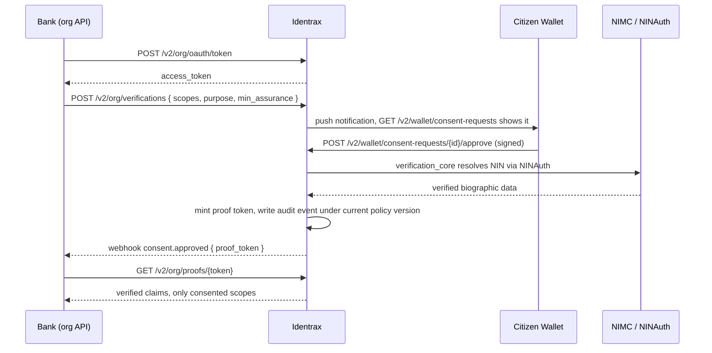
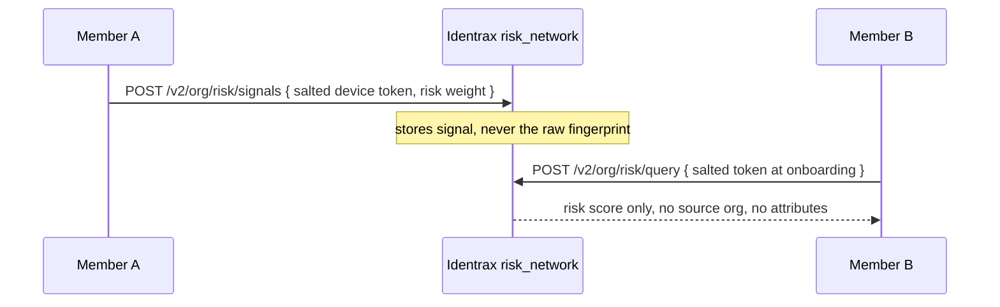
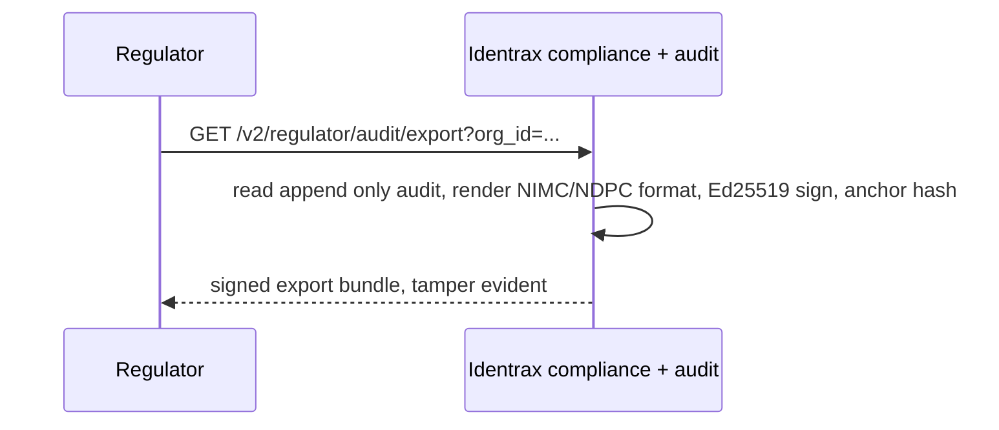

# Identrax Engineering Blueprint

## Everything We Are Building: APIs, Verifications, SDKs, Frontends, and Code Structure

**Engineering Reference v1.0**

*July 2026*

> This document is our working engineering reference. It sits underneath the strategy document (v3.0) and the technical architecture (v2.0), and its job is to be concrete. If a teammate wants to know exactly which APIs exist, what each verification does, which SDKs we ship, what every frontend screen shows, or where a given piece of logic lives in the codebase, they should find the answer here.
>
> One important change from the original whitepaper: **we are building the backend entirely in Rust.** The whitepaper described a Go service. We have moved to Rust for memory safety on a system that handles national identity data, for predictable performance under load, and because the cryptographic and concurrency guarantees matter more to us than raw development speed on this particular product.

---

## Table of Contents

1. [How to Read This Document](#1-how-to-read-this-document)
2. [The Rust Backend Stack](#2-the-rust-backend-stack)
3. [Code Structure: the Cargo Workspace](#3-code-structure-the-cargo-workspace)
4. [The Five Surfaces That Talk to Us](#4-the-five-surfaces-that-talk-to-us)
5. [The Complete Verification Catalog](#5-the-complete-verification-catalog)
6. [The Complete API Catalog](#6-the-complete-api-catalog)
7. [How the APIs Interact: Core Journeys](#7-how-the-apis-interact-core-journeys)
8. [How an Organization Onboards](#8-how-an-organization-onboards)
9. [How an Organization Uses Us Day to Day](#9-how-an-organization-uses-us-day-to-day)
10. [The SDKs We Ship](#10-the-sdks-we-ship)
11. [The Frontends and What Each One Shows](#11-the-frontends-and-what-each-one-shows)
12. [Environments, Versioning, Errors, and Limits](#12-environments-versioning-errors-and-limits)

---

## 1. How to Read This Document

We split the system by **who is talking to us** and **what they are trying to do**. There are five surfaces: the citizen wallet, the organization, the admin, the regulator, and the public verifier. Each surface has its own set of APIs, its own authentication method, and in most cases its own frontend. Everything below is organized around those five surfaces so that any given feature can be traced from the screen a human touches, through the API it calls, into the Rust crate that runs it, and out to the source it verifies against.

---

## 2. The Rust Backend Stack

We run a single deployable binary (a modular monolith with strict internal crate boundaries), the same shape as the original design, now expressed in Rust.

| Concern | What we use | Why we picked it |
|---------|-------------|------------------|
| Language | Rust (stable, 2021 edition) | Memory safety and predictable performance on identity data |
| Async runtime | Tokio | The de facto async runtime, mature and well supported |
| HTTP framework | Axum | Tower based, ergonomic, composes middleware cleanly |
| Database access | SQLx (async, compile checked queries) over PostgreSQL 16 | Query correctness verified at compile time |
| Migrations | SQLx migrations, checked into the repo | Reproducible schema, reviewed like code |
| Cache and queue | Redis 7 via deadpool-redis | Sub millisecond challenges, rate limits, idempotency |
| Object storage | S3 compatible via the AWS SDK for Rust | Encrypted document blobs |
| Serialization | serde and serde_json | Standard, fast, well understood |
| Signatures | ed25519-dalek | Fast, compact Ed25519 |
| Hashing | sha2, plus BLAKE3 where we want speed | NIN hashing, token hashing, content hashes |
| Symmetric encryption | aes-gcm | AES 256 GCM envelope encryption at rest |
| Session tokens | rusty_paseto (PASETO v4.local) | Secure by default, no algorithm confusion |
| Blockchain | alloy (Ethereum and Polygon) | Anchoring DID proofs and audit exports |
| Zero knowledge | arkworks and a Groth16 backend | Age, income, and credit band proofs |
| Errors | thiserror in libraries, anyhow at the edges | Typed errors internally, friendly errors outward |
| Config | figment with layered files and environment | One config model across environments |
| Telemetry | tracing and tracing-subscriber, structured JSON | Structured logs, spans, and metrics |
| Validation | validator plus our own business rules | Input validation at the boundary |
| Testing | built in test harness, plus testcontainers for Postgres and Redis | Real dependencies in integration tests |
| Container | Multi stage Docker, distroless final image, non root | Small, hardened production image |

---

## 3. Code Structure: the Cargo Workspace

We organize the backend as a Cargo **workspace** with one binary crate and many library crates. Each domain gets its own crate so that boundaries are enforced by the compiler, not by convention. A crate can only reach another crate if it declares the dependency, which is how we keep the Risk Intelligence Network from ever reading raw verification inputs.

```
identrax/
  Cargo.toml                  workspace manifest, shared dependency versions
  migrations/                 SQLx SQL migrations, one file per change
  crates/
    server/                   binary: builds the Axum router, wires middleware, boots the app
    common/                   shared types, ULID, error kinds, config, telemetry, time
    crypto/                   Ed25519, AES 256 GCM, SHA, PASETO, the challenge and response engine
    storage/                  the Postgres pool, Redis pool, repository traits, S3 client
    identity/                 NIN anchor, device registration, key binding
    auth/                     sessions, PASETO issuance, login via challenge and response
    challenge/                nonce creation, single use verification, lockout counters
    consent/                  consent requests, grants, scope checks, the reuse policy engine
    proof/                    proof token minting, retrieval, verification, expiry
    verification_core/        the stateless resolver that fans out to sources and composes claims
    sources/                  connectors: NIMC and NINAuth, NIBSS and BVN, address, education, employment
    screening/                AML, PEP, and sanctions screening, policies, dispositions
    credit/                   the multi signal credit scoring engine
    biometric/                liveness attestation and template hash handling
    did/                      the did:identrax method, DID document, resolver
    blockchain/               Polygon anchoring, confirmations, gas caps
    zkp/                      circuits, proving and verifying keys, proof instances
    offline/                  signed QR token issuance and reconnection reconcile
    sign/                     document signing, verification bundles, countersignatures
    profile/                  addresses, linked IDs, education records, encrypted vault
    audit/                    the append only audit store and the regulator ready exporter
    policy/                   the central policy engine that absorbs regulatory change
    compliance/              the live compliance posture engine and regulator export surface
    risk_network/             cross organization signal, salted tokens, one way ingest
    kyb/                      business verification, corporate registry, beneficial ownership
    travel_rule/             the isolated VASP and Travel Rule module
    webhook/                  outbound delivery, HMAC signing, retries, auto disable
    notify/                   push, SMS, and email fan out
    org/                      organization lifecycle, API keys, scope grants
    admin/                    admin operations and platform configuration
  sdks/                       source for the SDKs we publish (see Section 10)
  clients/                    the frontends: wallet, org portal, admin, regulator console, widget
```

**What each crate does, in one line each:**

- **server** assembles everything. It mounts the routers from each domain crate, applies the middleware stack (TLS termination is upstream, then request ID, tracing, auth, rate limit, body limits, idempotency), and starts Tokio.
- **common** holds the types everyone shares so we do not create circular dependencies. ULID generation, the canonical error enum, the config loader, and the tracing setup live here.
- **crypto** is the only crate allowed to touch key material and cipher primitives. Every other crate asks crypto to sign, verify, encrypt, or issue a challenge. Nothing reimplements crypto locally.
- **storage** owns the connection pools and the repository traits. Domain crates depend on the traits, not on SQLx directly, so we can test them against fakes.
- **identity, auth, challenge, consent, proof** are the core five. They implement registration, login, the challenge and response protocol, consent lifecycle, and proof tokens, exactly as the whitepaper describes, now in Rust.
- **verification_core** and **sources** are the heart of Layer 1. verification_core decides what to ask, sources knows how to ask each provider. Keeping them apart means adding a new source is a new file in sources, not a change to the resolver.
- **audit, policy, compliance** are Layer 2. audit records what happened, policy decides the rules that applied, compliance turns both into exports and a live posture.
- **risk_network** is Layer 3, and it depends only on hashed signal, never on identity or proof.
- **kyb** and **travel_rule** are our expansion modules, built on the same consent, proof, and audit crates.

---

## 4. The Five Surfaces That Talk to Us

| Surface | Who it is | How it authenticates | Base path |
|---------|-----------|----------------------|-----------|
| **Wallet** | The citizen, through the mobile app | Ed25519 challenge and response, device bound keys, PASETO session | `/v2/wallet` |
| **Organization** | A bank, insurer, telco, pension fund, land registry, or VASP | OAuth client credentials (API key and secret), short lived access token | `/v2/org` |
| **Admin** | Our own operations team | Static admin key with rotation, IP allowlist, per action audit | `/v2/admin` |
| **Regulator** | NIMC, NDPC, or CBN auditors | Regulator scoped credential, read only, heavily audited | `/v2/regulator` |
| **Public verifier** | Anyone verifying a proof, a DID, or an offline token | None for public reads, signature checks do the work | `/v2/verify` and `/v2/did` |

Everything a human or a machine does with us goes through exactly one of these five surfaces. This is also our security model: a wallet token can never call an org endpoint, an org token can never call an admin endpoint, and a regulator credential is read only by construction.

---

## 5. The Complete Verification Catalog

These are every verification we perform. Each one is a claim we resolve, minimize, and attest to. The "Returns" column is always a claim or a confidence, never a raw source document.

| Verification | Source we check | Returns | Sync or async | Consent needed | Assurance it feeds |
|--------------|-----------------|---------|---------------|----------------|--------------------|
| NIN verification | NIMC via NINAuth | `identity.nin_verified` (boolean), `name_match`, `age_over_18` | Sync | Yes | L1 |
| Device binding | Our own attestation of the device keystore | `identity.device_bound` (boolean) | Sync | Implicit at enrollment | L2 |
| Biometric liveness | On device liveness plus our attestation hash | `identity.liveness_passed` (boolean) | Sync | Yes | L3 |
| Phone verification | OTP to the SIM | `identity.phone_verified` (boolean) | Async | Yes | Supports L1 |
| Email verification | Verification link | `identity.email_verified` (boolean) | Async | Yes | Supporting |
| BVN verification | NIBSS | `linked_id.bvn.verified`, cross match confidence | Sync | Yes | Strengthens L1 |
| Passport verification | Immigration records where available | `linked_id.passport.verified` | Async | Yes | Supporting |
| Driver license verification | FRSC records where available | `linked_id.drivers_license.verified` | Async | Yes | Supporting |
| Address verification | GPS capture plus utility bill or registry | `address.verified`, `address.state`, confidence | Async | Yes | L4 |
| Education verification | University and accreditation APIs | `education.verified`, degree class banded | Async | Yes | Supporting |
| Employment and income | Employer attestation or payroll signal | `employment.verified`, `income_above_X` (ZK) | Async | Yes | L5 |
| Credit scoring | Consented alternative signals | `credit.band` (ZK), `credit.score` on strong consent | Sync after signals gathered | Yes | Feeds L5 and L6 |
| AML screening | OFAC, UN, and configured lists | `screening.aml` result, risk band | Sync with async escalation | Yes | Compliance |
| PEP screening | PEP data providers | `screening.pep` result | Sync | Yes | Compliance |
| Sanctions screening | Sanctions lists | `screening.sanctions` result | Sync | Yes | Compliance |
| Adverse media | Media and watchlist providers | `screening.adverse_media` result | Async | Yes | Compliance |
| Document signing | The citizen signing key | Signature verification bundle | Sync | Yes, per document | Non repudiation |
| Business verification (KYB) | Corporate registry (CAC) | `business.registered`, status, confidence | Async | Yes | KYB |
| Beneficial ownership | Ownership records | `business.ownership_confidence` (graded, never a bare pass) | Async | Yes | KYB |
| Travel Rule counterparty | Our proof token exchange between VASPs | Counterparty identity claim without the full file | Sync | Yes | VASP |
| Continuous risk monitoring | Ongoing signals plus the Risk Intelligence Network | Rolling risk score | Streaming | Standing consent | L6 |

Two rules hold across every row. First, we return the minimized claim, not the underlying value, unless the citizen gives strong consent for the value itself. Second, the reuse policy from the policy engine decides whether a given verification can be served from a recent result or must go live to the source, which is how we handle the durable consent question described in the architecture document.

---

## 6. The Complete API Catalog

Below is every endpoint we build, grouped by surface. Paths are versioned under `/v2`. Request and response bodies are JSON. Every write endpoint accepts an idempotency key.

### 6.1 Wallet APIs (the citizen, `/v2/wallet`)

**Enrollment and keys**
- `POST /v2/wallet/enroll/start` begins enrollment, takes the NIN, triggers NINAuth, returns an enrollment challenge.
- `POST /v2/wallet/enroll/complete` binds the device public keys (auth key and signing key) to the verified NIN, creates the identity anchor.
- `POST /v2/wallet/devices` registers an additional device.
- `DELETE /v2/wallet/devices/{id}` revokes a device and invalidates its sessions.

**Authentication (challenge and response)**
- `POST /v2/wallet/challenges` requests a single use challenge for a named action (login, consent, sign).
- `POST /v2/wallet/challenges/{id}/respond` submits the signed challenge, returns a PASETO session on success.
- `POST /v2/wallet/sessions/refresh` refreshes a session.
- `DELETE /v2/wallet/sessions` logs out and invalidates the session hash.

**Consent**
- `GET /v2/wallet/consent-requests` lists pending requests waiting for the citizen.
- `GET /v2/wallet/consent-requests/{id}` shows the full detail of one request: who is asking, which scopes, what purpose, how long.
- `POST /v2/wallet/consent-requests/{id}/approve` approves, signed with the auth key, mints the grant.
- `POST /v2/wallet/consent-requests/{id}/decline` declines.
- `GET /v2/wallet/consents` lists active grants.
- `DELETE /v2/wallet/consents/{id}` revokes a grant immediately.

**Profile and vault**
- `GET` and `PUT /v2/wallet/profile/addresses`
- `GET` and `PUT /v2/wallet/profile/linked-ids`
- `GET` and `PUT /v2/wallet/profile/education`
- `POST /v2/wallet/vault/documents` uploads an encrypted document.
- `GET /v2/wallet/vault/documents` lists vault documents.

**Signing**
- `GET /v2/wallet/sign-requests` lists documents awaiting the citizen's signature.
- `POST /v2/wallet/sign-requests/{id}/approve` signs with the signing key (the second PIN).

**Offline, audit, notifications, DID**
- `POST /v2/wallet/offline-tokens` mints a signed QR token for offline verification.
- `GET /v2/wallet/audit` shows the citizen every access to their data.
- `GET /v2/wallet/notifications` and `POST /v2/wallet/notifications/read`
- `GET /v2/wallet/did` returns the citizen's DID document.

### 6.2 Organization APIs (the business, `/v2/org`)

**Authentication**
- `POST /v2/org/oauth/token` exchanges the API key and secret for a one hour access token.

**Verification and proofs**
- `POST /v2/org/verifications` starts a verification, names the scopes, purpose, and minimum assurance, triggers a consent request to the citizen.
- `GET /v2/org/verifications/{id}` checks status.
- `GET /v2/org/proofs/{token}` retrieves the verified claims once consent is approved.
- `POST /v2/org/resolve` the direct Verification Core call for claims already covered by a standing consent, returns claims and match confidence.

**Screening and credit**
- `POST /v2/org/screening` runs AML, PEP, sanctions, or adverse media.
- `GET /v2/org/screening/{id}` fetches the result.
- `POST /v2/org/screening/{id}/dispositions` records a human review decision.
- `POST /v2/org/credit-scores` requests a consented credit assessment.

**Documents**
- `POST /v2/org/documents` requests a citizen signature on a document hash.
- `GET /v2/org/documents/{id}` retrieves the signed verification bundle.

**Business verification (KYB)**
- `POST /v2/org/business-verifications` verifies a company and its ownership.
- `GET /v2/org/business-verifications/{id}` fetches the graded result.

**Risk Intelligence Network**
- `POST /v2/org/risk/query` asks for a risk score on an identity or device token at onboarding.
- `POST /v2/org/risk/signals` emits a fraud or risk signal into the network as a salted token, never raw PII.

**Travel Rule**
- `POST /v2/org/travel-rule/verify` proves a counterparty's identity to another VASP without sending the full identity file.

**Compliance**
- `GET /v2/org/audit/export` produces a signed, regulator ready audit export for this organization's own activity.
- `GET /v2/org/compliance/posture` returns the live compliance posture and any alerts.

**Configuration**
- `GET /v2/org/scopes` lists the scopes this org is approved to request.
- `GET /v2/org/tiers` shows the pricing tiers and what each includes.
- `POST`, `GET`, `DELETE /v2/org/webhooks` manages webhook endpoints and subscribed events.
- `GET /v2/org/usage` returns verification volume and billing counters.

### 6.3 Admin APIs (our team, `/v2/admin`)

- `POST`, `GET`, `PATCH /v2/admin/orgs` organization lifecycle.
- `POST /v2/admin/orgs/{id}/scopes` approves the scopes an org may request.
- `GET`, `PUT /v2/admin/policies` reads and updates the central policy engine (assurance thresholds, reuse policies, retention, screening thresholds).
- `GET`, `PUT /v2/admin/screening-policies` manages screening list sources and thresholds.
- `GET`, `PUT /v2/admin/zk-circuits` manages ZK proof templates and keys.
- `GET /v2/admin/health` and `GET /v2/admin/metrics` platform health.
- `GET /v2/admin/audit` full audit search across the platform.

### 6.4 Regulator APIs (auditors, `/v2/regulator`)

- `GET /v2/regulator/audit/export` scoped, read only, signed audit export for a subject or an organization under investigation.
- `GET /v2/regulator/attestations` compliance attestations we produce for the regulator.
- `GET /v2/regulator/posture/{org_id}` the compliance posture of a named organization, read only.

### 6.5 Public verifier APIs (anyone, `/v2/verify` and `/v2/did`)

- `GET /v2/did/resolve/{did}` resolves a DID document, chained to the NIMC PKI root.
- `POST /v2/verify/proof` verifies a proof token or a signed bundle without needing an account.
- `POST /v2/verify/offline` verifies an offline QR payload's signature and expiry.
- `GET /.well-known/identrax-configuration` publishes our public keys and endpoints.

### 6.6 Outbound webhooks (we call the organization)

We deliver these events, HMAC SHA256 signed, with up to five retries and exponential backoff, auto disabling an endpoint after fifteen consecutive failures.

`consent.approved`, `consent.declined`, `consent.revoked`, `verification.completed`, `proof.issued`, `document.signed`, `screening.completed`, `screening.flagged`, `credit.completed`, `kyb.completed`, `risk.alert`, `compliance.alert`.

---

## 7. How the APIs Interact: Core Journeys

The endpoints above are not isolated. Here is how they connect on the journeys that matter most.

### 7.1 A bank verifies a new customer



### 7.2 The Risk Intelligence Network raises a flag



### 7.3 A regulator audits an organization



The through line is that **the org surface starts work, the wallet surface authorizes it, the verification core resolves it, the audit and policy crates record it, and the compliance surface can prove it later.** No claim moves without a consent grant, and no export can be altered after we sign it.

---

## 8. How an Organization Onboards

This is the exact path a new organization walks, from first contact to first live verification.

1. **We create the organization.** Our team uses `POST /v2/admin/orgs`. The org receives an API key and a secret. The secret is shown once and stored by them, we keep only its hash.
2. **We approve scopes.** Through `POST /v2/admin/orgs/{id}/scopes` we grant exactly the scopes their use case needs and no more. A telco does not get lending scopes.
3. **They configure webhooks.** The org registers one or more endpoints with `POST /v2/org/webhooks` and subscribes to the events they care about. We send a signed test event they must acknowledge.
4. **They authenticate.** The org calls `POST /v2/org/oauth/token` with the key and secret and receives a one hour access token. Their SDK handles refresh automatically.
5. **They pick an integration style.** Either they drive the flow themselves through the server SDK, or they drop in our consent widget (Section 10 and 11) so the citizen facing part ships inside their own app.
6. **They run a sandbox verification.** Against our sandbox environment with test NINs, they run the full loop: create a verification, approve it in a test wallet, fetch the proof. This is the two hour integration the strategy talks about.
7. **They sign the processor and controller boundary.** Before production keys are issued, the contract that defines us as processor and them as controller is in place. This is a hard gate, not a formality.
8. **We enable production.** We flip the org to live data sources, apply their pricing tier, and start metering usage through `GET /v2/org/usage`.

---

## 9. How an Organization Uses Us Day to Day

Once live, an organization interacts with us in a small number of repeating patterns.

- **Onboarding a customer.** They call `POST /v2/org/verifications`, the citizen approves in the wallet or the embedded widget, they receive `consent.approved` on their webhook, and they fetch the proof. For a customer they have already verified and hold a standing consent for, they skip straight to `POST /v2/org/resolve`.
- **Screening for compliance.** At onboarding or on a schedule, they call `POST /v2/org/screening`. A clean result clears automatically if their policy allows, a hit routes to their human reviewers through the disposition endpoint.
- **Getting a signature.** For a loan agreement or a policy document, they call `POST /v2/org/documents` and receive the signed bundle back when the citizen approves in the wallet.
- **Checking risk.** At account opening they call `POST /v2/org/risk/query`, and when they detect fraud they contribute back through `POST /v2/org/risk/signals`. The more they give, the better the network scores for everyone, including them.
- **Verifying a business.** For corporate customers and vendors they call `POST /v2/org/business-verifications` and receive a graded ownership result, never a bare pass.
- **Proving compliance.** When an auditor comes, they pull `GET /v2/org/audit/export` and hand over a signed, tamper evident bundle. They watch `GET /v2/org/compliance/posture` for alerts that a rule change affects them.
- **Managing their account.** They watch `GET /v2/org/usage` for volume and cost, and adjust webhooks and scopes as their product grows.

---

## 10. The SDKs We Ship

We publish SDKs so that an organization never writes raw HTTP against us, and so that the tricky parts (OAuth refresh, webhook signature verification, idempotency keys, retries, and the consent flow) are handled correctly by default.

### 10.1 Server side SDKs (for the organization's backend)

Each one wraps the entire org API surface, handles token refresh, verifies webhook signatures, and retries safely.

| SDK | Language and ecosystem | Primary users |
|-----|------------------------|---------------|
| **Rust SDK** | Rust crate, our reference SDK | Rust shops, and us internally for tests |
| **JavaScript and TypeScript SDK** | npm package, Node and Deno | The largest slice of Nigerian fintech |
| **Python SDK** | PyPI package | Data and backend teams, risk teams |
| **Java and Kotlin SDK** | Maven artifact | Banks and larger institutions |
| **PHP SDK** | Composer package | Web and merchant integrations |
| **Go SDK** | Go module | Infrastructure heavy teams |
| **.NET SDK** | NuGet package | Enterprise and insurance systems |

Every server SDK exposes the same shape: a client you construct with your key and secret, methods that mirror the API (`verifications.create`, `proofs.get`, `screening.run`, `risk.query`, `kyb.verify`, `audit.export`), a webhook verifier, and typed models for every claim.

### 10.2 Client side SDKs (for the citizen facing part)

| SDK | What it is | Where it runs |
|-----|------------|---------------|
| **Flutter Wallet SDK** | The consent, key management, and signing logic of the wallet, packaged so it can ship inside the org's own app | Android and iOS |
| **Web Consent Widget** | A drop in JavaScript widget that renders the consent request and handles approval, embeddable in any web page | The organization's website |
| **React Native SDK** | The same consent flow for React Native apps | Android and iOS |
| **Mobile verification SDK (Android and iOS native)** | Native bindings for teams not on Flutter, covering device attestation and liveness capture | Android and iOS |

### 10.3 Webhook helper libraries

For teams who do not want a full SDK, we ship small single purpose libraries in each language that do one thing: verify our `X-Webhook-Signature` HMAC and parse the event. This lowers the barrier to receiving events safely.

---

## 11. The Frontends and What Each One Shows

Yes, there are frontends. There are five of them. The wallet is Flutter, the three consoles are React (with React Router), and the widget is a small embeddable JavaScript bundle. Here is exactly what each one shows.

### 11.1 Citizen Wallet (Flutter, Android and iOS)

This is the citizen's home for their identity. It talks only to the wallet API.

- **Enrollment screens.** Enter NIN, verify through NINAuth, set the two PINs, generate device keys in the secure keystore.
- **Home.** A summary of the citizen's identity, their assurance level, and anything waiting for them.
- **Consent inbox.** The list of pending consent requests, and for each one a detail screen showing who is asking, exactly which fields, the purpose, and the duration, with clear approve and decline actions guarded by biometric or PIN.
- **Active consents.** Everything the citizen has granted, with a one tap revoke.
- **Audit trail.** A human readable history of every time their data was accessed, by whom, and why.
- **Documents to sign.** Pending signature requests, with a review then sign flow guarded by the second PIN.
- **Profile.** Addresses, linked IDs, and education, each showing its verification status.
- **Vault.** Their encrypted documents.
- **Offline QR.** Generate a signed QR code for verification without internet.
- **Settings.** Devices, key management, notifications, and account deactivation.

### 11.2 Organization Portal (React)

This is where a business self serves. It talks to the org API.

- **Dashboard.** Verification volume, success rates, recent activity, and current spend.
- **Verifications.** Create a verification, and browse and inspect past ones with their status and claims returned.
- **Screening.** Run and review AML, PEP, and sanctions results, and work a queue of hits needing a human decision.
- **KYB.** Verify businesses and view graded ownership results.
- **Risk.** Query risk and view alerts from the Risk Intelligence Network.
- **Compliance.** The live posture dashboard, alerts when a rule change affects them, and a one click signed audit export for auditors.
- **Documents.** Request signatures and download signed bundles.
- **Developers.** API keys, webhook endpoints and their delivery logs, approved scopes, and sandbox toggles.
- **Billing and usage.** Volume by tier, invoices, and cost projections.

### 11.3 Admin Dashboard (React)

This is our own operations console, deployed separately for isolation. It talks to the admin API.

- **Organizations.** Create, suspend, and configure orgs, and approve the scopes each may request.
- **Policy engine.** Edit the central rules that absorb regulatory change: assurance thresholds, reuse policies, retention windows, and screening thresholds, all versioned.
- **Screening configuration.** Manage list sources and thresholds.
- **ZK circuits.** Manage proof templates and keys.
- **Monitoring.** Platform health, source availability, and degraded mode status.
- **Audit.** Full platform audit search for our own investigations.

### 11.4 Regulator Console (React, new)

A narrow, read only console for NIMC, NDPC, and CBN auditors. It talks to the regulator API.

- **Scoped audit search.** Look up the history of a subject or an organization under investigation.
- **Signed exports.** Download tamper evident, signed audit bundles.
- **Posture view.** See a named organization's live compliance posture.

Everything here is read only and every access a regulator makes is itself audited.

### 11.5 Web Consent Widget (embeddable JavaScript)

Not a full app, but a frontend all the same. It is the drop in that lets an organization keep the citizen inside their own web flow. It renders the consent request, handles approval, and hands the result back to the organization's page, so the consent and proof layer ships invisibly inside a flow the organization already owns.

---

## 12. Environments, Versioning, Errors, and Limits

**Environments.** We run sandbox and production. Sandbox uses test NINs and never touches live NIMC data, so an organization can integrate fully before we issue production keys.

**Versioning.** The API is versioned in the path, currently `/v2`. We do not make breaking changes within a version. When we must break, we ship `/v3` and run both in parallel through a deprecation window.

**Errors.** Every error response carries a stable machine readable code, a human readable message, and a request ID that ties back to our traces. The same request ID appears in our logs, so when an organization reports a problem we can find the exact request.

**Idempotency.** Every write accepts an `X-Idempotency-Key`. We cache the result in Redis, so a retried request never double charges or double verifies.

**Rate limits.** We apply layered limits: a global ceiling, a per wallet limit, a per organization limit, and a hard cap on NIN verification per number per day to prevent harvesting. Challenge failures trigger a lockout after a small number of attempts.

**Observability.** Every request is traced end to end with a span, structured JSON logs carry no raw PII, and we expose health and metrics endpoints for our own monitoring.

---

*This is a living engineering document. As we confirm NIMC accreditation terms and the implementing regulations, the reuse policies, the PKI chaining in the DID resolver, and the exact source connectors will firm up, and we will update this reference in step with the code.*
