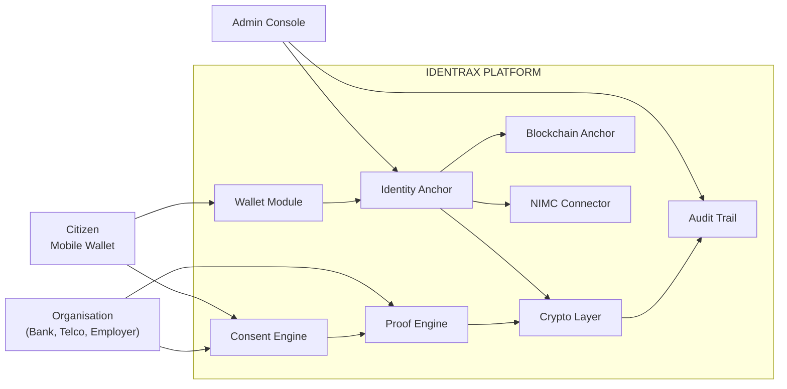

# Identrax: A NIN-Anchored, Consent-Driven Digital Identity Platform for Nigeria

**Whitepaper v1.0**

*February 2026*

---

## Abstract

Nigeria has over 220 million citizens, yet verifiable digital identity remains fragmented, centralized, and privacy-hostile. Financial institutions, telcos, employers, and government agencies each build isolated KYC silos, duplicating effort, increasing breach surface, and forcing citizens to surrender raw personal data to every requesting party — with no visibility into how that data is used.

**Identrax** is a NIN-anchored, mobile-wallet-based digital identity platform that fundamentally inverts this model. Instead of copying personal data to every verifier, Identrax places the citizen at the center: a cryptographic wallet on their device holds their identity credentials, and organizations can only access verified claims through time-limited, scope-restricted, user-approved consent grants. The platform never mints new identities — it anchors to Nigeria's existing National Identification Number (NIN) infrastructure, then layers privacy-preserving proofs, consent management, document signing, credit scoring, and blockchain-anchored decentralized identifiers on top.

This whitepaper presents the problem space, architectural philosophy, technical design, security model, economic analysis, and deployment roadmap for Identrax.

---

## Table of Contents

1. [The Problem](#1-the-problem)
2. [Vision & Principles](#2-vision--principles)
3. [System Overview](#3-system-overview)
4. [Identity Model](#4-identity-model)
5. [Consent Architecture](#5-consent-architecture)
6. [Cryptographic Foundation](#6-cryptographic-foundation)
7. [Verification Protocol](#7-verification-protocol)
8. [Decentralized Identity Layer](#8-decentralized-identity-layer)
9. [Zero-Knowledge Proofs](#9-zero-knowledge-proofs)
10. [Credit Scoring Engine](#10-credit-scoring-engine)
11. [AML/KYC Screening](#11-amlkyc-screening)
12. [Offline Verification](#12-offline-verification)
13. [Security Model](#13-security-model)
14. [Privacy by Design](#14-privacy-by-design)
15. [Platform Architecture](#15-platform-architecture)
16. [Integration Model](#16-integration-model)
17. [Economic Analysis](#17-economic-analysis)
18. [Regulatory Alignment](#18-regulatory-alignment)
19. [Competitive Landscape](#19-competitive-landscape)
20. [Roadmap](#20-roadmap)
21. [Conclusion](#21-conclusion)
22. [References](#22-references)

---

## 1. The Problem

### 1.1 Identity Fragmentation in Nigeria

Nigeria's identity ecosystem is deeply fragmented. Citizens interact with multiple identity systems — NIN, BVN (Bank Verification Number), voter's card, driver's license, international passport — each maintained by different agencies with limited interoperability. Verifying a citizen's identity requires organizations to independently connect to each data source, creating redundant infrastructure and inconsistent experiences.

### 1.2 The KYC Duplication Problem

Every bank, fintech, telco, and government service runs its own KYC process. A single Nigerian citizen may complete KYC dozens of times across their financial and civic life, each time surrendering the same raw personal data — name, date of birth, address, photograph, NIN — to yet another database. This creates:

- **Data duplication**: The same PII exists in hundreds of databases with varying security postures.
- **Breach amplification**: Each copy is a potential breach point. A breach at any one institution exposes data collected from many.
- **Citizen powerlessness**: Individuals have no visibility into which organizations hold their data, for what purpose, or for how long.
- **High compliance cost**: Each organization bears the full cost of verification infrastructure, data storage, and regulatory compliance.

### 1.3 The Trust Deficit

Current verification APIs return raw personal data to the requesting organization. Once data leaves the authoritative source, there is no mechanism to:

- Restrict what the organization does with it
- Limit how long they retain it
- Notify the citizen when their data is accessed
- Revoke access after the original purpose is fulfilled

This creates a fundamental trust deficit between citizens and institutions.

### 1.4 Financial Exclusion

An estimated 36% of Nigerian adults remain unbanked or underbanked. A significant driver is the difficulty and cost of identity verification. Rural populations face physical barriers to NIN enrollment, and the multi-step, in-person KYC process deters adoption of formal financial services. A portable, reusable digital identity that reduces verification friction can directly expand financial inclusion.

### 1.5 The Cross-Border Identity Gap

As Nigerian citizens travel, work, and transact internationally, their domestically-anchored identity credentials have no portable, machine-verifiable format. Embassies, foreign employers, and international institutions have no standardized way to verify Nigerian identity claims, forcing expensive manual processes.

---

## 2. Vision & Principles

### 2.1 Vision

**A Nigeria where every citizen controls their own verified identity — where organizations can verify without collecting, and where identity is a right, not a product.**

Identrax envisions a world where:

- A citizen opens a bank account by approving a 30-second consent request on their phone — no paperwork, no photocopies, no branch visit.
- A landlord verifies a prospective tenant's employment without ever seeing their payslip.
- An employer confirms a degree without accessing the full academic transcript.
- A citizen travelling abroad proves their identity to immigration authorities using a cryptographically-signed, blockchain-anchored digital credential.
- All of this happens with the citizen's explicit, informed, revocable consent.

### 2.2 Core Principles

| # | Principle | Description |
|---|-----------|-------------|
| 1 | **NIN is the root** | We do not mint new identities. Every Identrax identity is anchored to a verified NIN. |
| 2 | **Keys never leave the device** | The backend stores only public keys. Private keys are generated and held in the device's secure keystore (TEE/Secure Enclave). |
| 3 | **No passwords, ever** | All authentication is cryptographic challenge-response. No shared secrets. |
| 4 | **Consent is explicit, scoped, and revocable** | Every data access requires a fresh, purpose-bound, time-limited consent grant that the citizen can revoke at any time. |
| 5 | **Proofs over PII** | APIs return verified boolean claims ("NIN is verified", "age ≥ 18"), not raw personal data, unless the citizen explicitly consents to more. |
| 6 | **Immutable audit trail** | Every sensitive operation — consent, verification, signing — creates an immutable audit event visible to the citizen. |
| 7 | **Offline-capable** | Core identity verification works without internet through signed QR codes. |
| 8 | **Never sell data** | The platform will never sell, trade, or monetize personal identity data. |

### 2.3 Non-Goals

The platform will **never**:

- Sell raw identity data
- Run social or political scoring
- Serve advertising
- Perform behavioral surveillance
- Replace NIN or any government identity system
- Store biometric templates (only attestation hashes)

---

## 3. System Overview

Identrax is a three-sided platform connecting **citizens**, **organizations**, and **administrators** through a unified identity verification gateway.



### 3.1 Platform Components

| Component | Description |
|-----------|-------------|
| **Citizen Wallet** | Flutter mobile app (Android/iOS) with secure keystore, biometric auth, QR scanning |
| **API Gateway** | Go-based REST API with modular monolith architecture (18 domain modules) |
| **Organisation Portal** | React web dashboard for managing verifications, webhooks, and integrations |
| **Admin Dashboard** | React web dashboard for platform operations, org management, and monitoring |
| **NIMC Connector** | Integration layer for NIN verification with the National Identity Management Commission |
| **Blockchain Connector** | Polygon (EVM) integration for anchoring DID proofs and cross-border credentials |

---

## 4. Identity Model

### 4.1 NIN Anchoring

Every Identrax identity begins with a verified NIN. The registration flow:

```
┌────────────────┐     ┌─────────────┐     ┌──────────────┐
│ Citizen enters │────▶│ NIMC verifies│────▶│ Identity     │
│ NIN in wallet  │     │ NIN is valid │     │ Anchor       │
│                │     │ + returns    │     │ created      │
│                │     │   biographic │     │ (NIN hashed, │
│                │     │   data       │     │  encrypted)  │
└────────────────┘     └─────────────┘     └──────────────┘
```

**What we store:**

| Field | Storage Method | Purpose |
|-------|---------------|---------|
| NIN | SHA-256 hash | Lookup & deduplication |
| NIN (last 4) | Plaintext | Display hint for citizen |
| NIN (full) | AES-256-GCM encrypted | Recovery & re-verification (optional) |
| Name, DOB, etc. | Not stored | Retrieved on-demand via NIMC with consent |

The platform **does not create a parallel identity database**. It creates a cryptographic binding between the citizen's device-held keys and their government-issued NIN.

### 4.2 Assurance Levels

Identity claims carry progressive assurance levels, each building on the previous:

```
┌─────────────────────────────────────────────────────────────┐
│                    ASSURANCE LADDER                           │
│                                                             │
│  L6 ─── Continuous risk monitoring (Phase 4)          ▲     │
│  L5 ─── Verified employment + income (Phase 3)       │     │
│  L4 ─── Verified address (Phase 2)                   │     │
│  L3 ─── Biometric/PIN-verified action            ┌───┘     │
│  L2 ─── Device-bound wallet with attested keys   │  V1     │
│  L1 ─── NIN verified                             └───┐     │
│                                                       │     │
│  Organizations can request a minimum assurance level  ▼     │
│  for each verification request.                             │
└─────────────────────────────────────────────────────────────┘
```

| Level | Requirement | What it Proves |
|-------|-----------|---------------|
| **L1** | NIN verified via NIMC | Person is who they claim to be |
| **L2** | L1 + device-bound wallet with hardware-attested keys | Identity is bound to a specific physical device |
| **L3** | L2 + biometric or PIN-verified action | The person holding the device authorized this specific action |
| **L4** | L3 + verified address | Person has a confirmed physical location |
| **L5** | L4 + verified employment/income | Person has confirmed economic standing |
| **L6** | L5 + continuous risk signals | Ongoing confidence in identity validity |

### 4.3 Device-Bound Keys

Each citizen device holds two asymmetric keypairs:

```
┌──────────────────────────────────────────┐
│              DEVICE KEYSTORE             │
│          (TEE / Secure Enclave)          │
│                                          │
│  ┌─────────────────────────────────────┐ │
│  │  AUTH KEY (PIN 1)                   │ │
│  │  Algorithm: Ed25519                 │ │
│  │  Purpose: Login, consent approval   │ │
│  │  Activation: Biometric / PIN        │ │
│  └─────────────────────────────────────┘ │
│                                          │
│  ┌─────────────────────────────────────┐ │
│  │  SIGNING KEY (PIN 2)               │ │
│  │  Algorithm: Ed25519                 │ │
│  │  Purpose: Document signing          │ │
│  │  Activation: Separate PIN/biometric │ │
│  └─────────────────────────────────────┘ │
│                                          │
│  Private keys NEVER leave this enclave.  │
│  Backend stores only public keys.        │
└──────────────────────────────────────────┘
```

This follows the **Smart-ID model** (widely deployed in Estonia) where two-key separation ensures that consent approval and document signing have distinct authorization channels — a compromise of one key does not compromise the other.

### 4.4 Profile Data Model

Citizens can enrich their identity with verifiable credentials:

```
                         ┌────────────┐
                         │    USER    │
                         └─────┬──────┘
              ┌────────────┬───┼───┬────────────┐
              ▼            ▼   │   ▼            ▼
        ┌──────────┐ ┌────────┐│┌──────────┐┌──────────┐
        │ Addresses│ │Linked  │││Education ││  Vault   │
        │          │ │  IDs   │││Credentials││Documents │
        │ • line1  │ │ • BVN  │││• degree  ││• uploaded│
        │ • city   │ │ • pass-│││• school  ││  files   │
        │ • state  │ │   port │││• class   ││• encrypted│
        │ • geo    │ │ • DL   │││• dates   ││• versioned│
        │ • verify │ │ • verify│││• verify  ││          │
        │   status │ │  status│││  status  ││          │
        └──────────┘ └────────┘│└──────────┘└──────────┘
                               │
                    ┌──────────▼──────────┐
                    │  ATTESTATIONS       │
                    │  (Org-signed proofs  │
                    │   of verification)  │
                    └─────────────────────┘
```

Each profile field can be independently attested by an authorized organization, creating a web of trust without a central authority.

---

## 5. Consent Architecture

Consent is the cornerstone of Identrax. No data flows without explicit, informed, purpose-bound citizen approval.

### 5.1 Consent Properties

Every consent grant has:

| Property | Description |
|----------|-------------|
| **Scopes** | Exactly which data fields are accessible (e.g., `nin_verified`, `address_state`) |
| **Purpose** | Why the data is being requested (e.g., `loan_application`, `kyc_aml`) |
| **Duration** | How long the consent is valid (one-time, time-limited, or ongoing) |
| **Revocability** | Citizen can revoke at any time; revocation is immediate and audited |
| **Cryptographic binding** | Consent is signed by the citizen's auth key, creating non-repudiable proof |

### 5.2 Consent Flow

```
┌──────────────┐                    ┌──────────────┐                    ┌──────────────┐
│ Organisation │                    │   Identrax   │                    │   Citizen    │
│              │                    │   Platform   │                    │   Wallet     │
└──────┬───────┘                    └──────┬───────┘                    └──────┬───────┘
       │                                   │                                   │
       │  1. "I need to verify this        │                                   │
       │      person's identity"           │                                   │
       │  POST verification-request        │                                   │
       │  { scopes, purpose, assurance }   │                                   │
       │──────────────────────────────────▶│                                   │
       │                                   │                                   │
       │                                   │  2. Create ConsentRequest         │
       │                                   │     Push notification             │
       │                                   │────────────────────────────────▶ │
       │                                   │                                   │
       │                                   │  3. Citizen reviews:              │
       │                                   │     "Bank XYZ wants to verify:    │
       │                                   │      ✓ NIN is valid               │
       │                                   │      ✓ Full name                  │
       │                                   │      ✓ Date of birth              │
       │                                   │      Purpose: Account opening     │
       │                                   │      Duration: One-time"          │
       │                                   │                                   │
       │                                   │  4. Citizen approves (biometric)  │
       │                                   │     Signs consent with Auth Key   │
       │                                   │◀────────────────────────────────  │
       │                                   │                                   │
       │                                   │  5. Platform creates:             │
       │                                   │     • ConsentGrant (signed)       │
       │                                   │     • ProofToken (time-limited)   │
       │                                   │     • AuditEvent (immutable)      │
       │                                   │     • Webhook → Organisation      │
       │                                   │                                   │
       │  6. Webhook: consent.approved     │                                   │
       │     { proof_token }               │                                   │
       │◀──────────────────────────────────│                                   │
       │                                   │                                   │
       │  7. GET /proofs/{token}           │                                   │
       │──────────────────────────────────▶│                                   │
       │                                   │                                   │
       │  8. { claims: verified data }     │  8. Platform returns ONLY the     │
       │     Only consented scopes         │     scopes the citizen approved.  │
       │◀──────────────────────────────────│     Token expires after 10min.    │
       │                                   │                                   │
```

### 5.3 Scope Registry

Scopes follow a hierarchical naming convention:

```
identity.nin_verified      → Boolean: NIN is verified
identity.name              → String: Full name (strong consent required)
identity.name_match        → Boolean: Name matches provided value
identity.dob               → Date: Date of birth (strong consent required)
identity.age_over_18       → Boolean: Person is over 18
identity.phone_verified    → Boolean: Phone is verified
address.verified           → Boolean: Address is verified
address.state              → String: State of residence only
linked_id.bvn.verified     → Boolean: BVN is verified
education.verified         → Boolean: Has verified credential
credit.score               → Object: Credit score + band
screening.aml              → Object: AML screening result
```

The scope system enforces **data minimization**: an organization requesting age verification receives only `true` or `false`, never the actual date of birth.

### 5.4 Consent Purposes

| Purpose | Description | Typical Scopes |
|---------|-------------|---------------|
| `identity_verification` | General identity check | `nin_verified`, `name` |
| `account_opening` | Bank/fintech onboarding | `nin_verified`, `name`, `dob`, `address` |
| `loan_application` | Credit assessment | `nin_verified`, `credit.score`, `employment` |
| `employment_verification` | Employer background check | `nin_verified`, `education`, `name` |
| `kyc_aml` | Compliance screening | `nin_verified`, `screening.aml`, `name` |
| `age_verification` | Age gate | `age_over_18` or `age_over_21` |
| `visa_application` | Immigration verification | `nin_verified`, `name`, `address`, `employment` |

---

## 6. Cryptographic Foundation

### 6.1 Overview

```
┌──────────────────────────────────────────────────────────────────┐
│                    CRYPTOGRAPHIC LAYERS                           │
│                                                                  │
│  ┌──────────────────────────────────────────────────────────┐    │
│  │  IDENTITY BINDING                                        │    │
│  │  Ed25519 keypairs (per-device, hardware-backed)          │    │
│  │  Challenge-response: no shared secrets                   │    │
│  └──────────────────────────────────────────────────────────┘    │
│                                                                  │
│  ┌──────────────────────────────────────────────────────────┐    │
│  │  DATA PROTECTION                                         │    │
│  │  SHA-256 hashing (NIN, tokens, documents)                │    │
│  │  AES-256-GCM envelope encryption (NIN, webhook secrets)  │    │
│  └──────────────────────────────────────────────────────────┘    │
│                                                                  │
│  ┌──────────────────────────────────────────────────────────┐    │
│  │  SESSION MANAGEMENT                                      │    │
│  │  PASETO v4.local tokens (symmetric, not JWT)             │    │
│  │  Only SHA-256 hashes stored server-side                  │    │
│  └──────────────────────────────────────────────────────────┘    │
│                                                                  │
│  ┌──────────────────────────────────────────────────────────┐    │
│  │  INTEGRITY & NON-REPUDIATION                             │    │
│  │  Ed25519 platform signing key (proof tokens, QR codes)   │    │
│  │  HMAC-SHA256 webhook payload signing                     │    │
│  │  Blockchain anchoring (Polygon) for immutable proofs     │    │
│  └──────────────────────────────────────────────────────────┘    │
│                                                                  │
│  ┌──────────────────────────────────────────────────────────┐    │
│  │  PRIVACY                                                  │    │
│  │  Zero-knowledge proofs (age, credit band — without PII)  │    │
│  │  Selective disclosure via scoped consent                  │    │
│  └──────────────────────────────────────────────────────────┘    │
└──────────────────────────────────────────────────────────────────┘
```

### 6.2 Challenge-Response Protocol

All sensitive operations (login, consent, signing) use a single-use cryptographic challenge:

```
1. Server generates: { challenge_id, nonce, expires_at, audience, action_type }
2. Challenge stored in Redis with TTL (5 minutes)
3. Client signs: SHA-256(challenge_id : nonce : type : audience : payload_hash : expires_at)
4. Client sends: { challenge_id, signature }
5. Server: fetches challenge from Redis (atomic get-and-delete)
   → verifies signature against device's public key
   → verifies challenge hasn't expired
   → challenge is consumed (single-use)
```

This eliminates:
- **Password-based attacks** (no passwords exist)
- **Replay attacks** (challenges are single-use)
- **Session hijacking** (signatures are bound to specific devices)

### 6.3 Why PASETO Over JWT

| Property | JWT | PASETO v4.local |
|----------|-----|----------------|
| Algorithm agility | Yes (danger) | No (fixed AES-256-CTR + HMAC) |
| `alg: none` attack | Possible | Impossible |
| Key confusion attack | Possible | Impossible |
| Implementation footguns | Many | Minimal |
| Standard | RFC 7519 | IETF draft, widely audited |

Identrax uses PASETO v4.local (symmetric encryption) for session tokens. The server never stores the raw token — only its SHA-256 hash — so even a database breach does not expose valid session tokens.

---

## 7. Verification Protocol

### 7.1 Proof Tokens

When a citizen approves a consent request, the platform issues a **Proof Token** — a short-lived, scope-bound, platform-signed artifact that the requesting organization uses to retrieve verified claims.

```json
{
  "sub": "user:01HXM3NDEKTSV4RRFFQ69G5FAV",
  "aud": "org:first_bank",
  "scopes": ["nin_verified", "name", "dob"],
  "claims": {
    "nin_verified": true,
    "name": "Chidozie Okafor",
    "dob": "1990-05-15"
  },
  "assurance_level": "L3",
  "issued_at": "2026-02-08T12:00:00Z",
  "expires_at": "2026-02-08T12:10:00Z",
  "proof_signature": "base64url(Ed25519(platform_key, payload))"
}
```

**Properties:**
- **Time-limited**: Expires after 10 minutes (configurable)
- **Scope-bound**: Contains only the claims the citizen consented to
- **Platform-signed**: Ed25519 signature proves the claims come from Identrax
- **Single-use**: Consumed on first access (optional, per org configuration)
- **Audited**: Every access is logged in the immutable audit trail

### 7.2 Document Signing

Organizations can request citizens to digitally sign documents (contracts, agreements, consent forms):

```
1. Org uploads document hash + metadata → Platform
2. Platform creates SignedDocument (status: awaiting_signature)
3. Citizen receives push notification → opens sign request in wallet
4. Citizen reviews document → approves with Signing Key (PIN 2)
5. Wallet signs: Ed25519(sign_private_key, document_hash)
6. Platform verifies signature → creates verification bundle:
   {
     document_hash,
     signer_public_key,
     signature,
     timestamp,
     device_attestation,
     platform_countersignature
   }
7. Organization can independently verify the bundle
```

---

## 8. Decentralized Identity Layer

### 8.1 Why DID?

Decentralized Identifiers (DIDs) extend Identrax beyond Nigerian borders. A DID is a globally-resolvable identifier that is:

- **Self-sovereign**: Controlled by the citizen, not any institution
- **Cryptographically verifiable**: Linked to the citizen's public keys
- **Blockchain-anchored**: Tamper-evident through on-chain hash anchoring
- **Interoperable**: Follows W3C DID Core specification

### 8.2 DID Method

Identrax implements a custom DID method: `did:identrax`

```
did:identrax:01HXM3NDEKTSV4RRFFQ69G5FAV
    └──────┘ └────────────────────────────┘
     method         ULID identifier
```

The DID Document contains:

```json
{
  "@context": "https://www.w3.org/ns/did/v1",
  "id": "did:identrax:01HXM3NDEKTSV4RRFFQ69G5FAV",
  "verificationMethod": [{
    "id": "#auth-key-1",
    "type": "Ed25519VerificationKey2020",
    "publicKeyMultibase": "z6Mkf..."
  }],
  "authentication": ["#auth-key-1"],
  "service": [{
    "type": "IdentraxWallet",
    "serviceEndpoint": "https://api.identrax.ng/v1/did/resolve/..."
  }]
}
```

### 8.3 Blockchain Anchoring

DID proofs are anchored to the **Polygon** blockchain (EVM-compatible, low-cost):

```
┌──────────────┐                    ┌──────────────────┐
│ Identrax API │                    │  Polygon Network │
│              │                    │                  │
│ 1. Compute   │     EIP-1559      │                  │
│    content   │─── Zero-value ────▶│  Transaction     │
│    hash      │     transaction    │  data = hash     │
│              │     with hash as   │                  │
│ 2. Store     │     calldata       │  Block N:        │
│    txHash +  │                    │  0x7a3f...       │
│    blockNum  │                    │                  │
│              │◀── Receipt ────────│  Confirmations:  │
│ 3. Wait for  │                    │  1 → 5 → 30     │
│    30 confs  │                    │                  │
└──────────────┘                    └──────────────────┘

Cost per anchor: ~30,000 gas ≈ $0.001 on Polygon
Finality: ~30 block confirmations ≈ 1 minute
```

**Why Polygon?**
- EVM-compatible (largest developer ecosystem)
- Sub-cent transaction costs
- 2-second block times
- Strong validator set and network security
- Growing adoption in identity use cases

### 8.4 Cross-Border Verification

With blockchain-anchored DIDs, a Nigerian citizen can prove their identity to:

- **Foreign embassies** (visa applications)
- **International employers** (remote hiring)
- **Cross-border financial institutions** (remittances, banking)
- **International education institutions** (admissions)

The verifier resolves the DID, checks the blockchain anchor, and verifies the cryptographic proof — all without contacting Identrax servers.

---

## 9. Zero-Knowledge Proofs

### 9.1 The Privacy Problem

Even with scoped consent, some verifications reveal more than necessary. When a bar checks a patron's age, the bouncer sees their full date of birth, name, and address on the ID card. In the digital world, we can do better.

### 9.2 ZK-Based Claims

Identrax supports zero-knowledge proofs for privacy-preserving claims:

| Claim | What Verifier Learns | What Verifier Does NOT Learn |
|-------|---------------------|----------------------------|
| `age_over_18` | Person is ≥ 18 years old | Exact date of birth |
| `credit_band_good` | Credit score is in "good" band | Exact score |
| `income_above_X` | Income exceeds threshold | Exact income |
| `resident_of_lagos` | Person lives in Lagos | Exact address |

### 9.3 Architecture

```
┌──────────────────────────────────────────────────────┐
│                    ZK PROOF SYSTEM                     │
│                                                      │
│  ┌────────────────┐                                  │
│  │   ZK CIRCUIT   │  Admin-managed proof templates   │
│  │                │  • claim_type (e.g. "age_over")  │
│  │  proving_key   │  • proof_system (groth16, etc.)  │
│  │  verify_key    │  • input schemas                 │
│  └───────┬────────┘                                  │
│          │                                           │
│          ▼                                           │
│  ┌────────────────┐                                  │
│  │   ZK PROOF     │  Per-user, per-claim instance    │
│  │                │  • proof_data (opaque bytes)     │
│  │  public_inputs │  • nonce (one-time use)          │
│  │  verified: T/F │  • max_verifications             │
│  │  expires_at    │  • expires_at                    │
│  └────────────────┘                                  │
│                                                      │
│  Flow:                                               │
│  1. Citizen requests proof via wallet                 │
│  2. Platform generates proof using citizen's data     │
│  3. Proof is verifiable by anyone with the verify key│
│  4. Citizen's actual data is never revealed           │
└──────────────────────────────────────────────────────┘
```

---

## 10. Credit Scoring Engine

### 10.1 Motivation

Traditional credit scoring in Nigeria relies on limited data from credit bureaus, excluding the 60%+ of adults who lack formal credit histories. Identrax's consent-based architecture enables a new model: **consented multi-signal credit scoring**.

### 10.2 Architecture

```
┌──────────────────────────────────────────────────────────────┐
│                    CREDIT SCORING ENGINE                       │
│                                                              │
│  ┌─────────────────┐     ┌─────────────────┐                │
│  │  SCORING MODEL  │     │  CREDIT SIGNAL  │                │
│  │                 │     │                 │                │
│  │  weight_config  │     │  source_type:   │                │
│  │  band_thresholds│     │  • utility_bill │                │
│  │  min_signals    │     │  • rent_payment │                │
│  │  min_confidence │     │  • telco_usage  │                │
│  │  validity_days  │     │  • bank_txn     │                │
│  └────────┬────────┘     │  • employment   │                │
│           │              │                 │                │
│           │              │  raw_value      │                │
│           │              │  normalized     │                │
│           │              │  weight         │                │
│           │              │  weighted_      │                │
│           │              │    contribution │                │
│           │              └────────┬────────┘                │
│           │                       │                          │
│           ▼                       ▼                          │
│  ┌─────────────────────────────────────────┐                │
│  │            SCORE COMPUTATION            │                │
│  │                                         │                │
│  │  score = Σ(signal.weighted_contribution)│                │
│  │  band  = map(score, band_thresholds)    │                │
│  │  confidence = f(signal_count, diversity)│                │
│  │                                         │                │
│  │  Output: 0-1000 score, band, confidence │                │
│  └─────────────────────────────────────────┘                │
│                                                              │
│  Bands: very_poor | poor | fair | good | very_good | excellent│
│  All signals require active consent grants.                  │
│  Scores expire and must be re-computed periodically.         │
└──────────────────────────────────────────────────────────────┘
```

### 10.3 Key Differentiator

Unlike traditional credit bureaus that collect data without direct citizen involvement, Identrax's credit scoring:

1. **Requires explicit consent** for every data signal
2. **Is transparent** — citizens see which signals contributed to their score
3. **Is portable** — citizens can share their score with any organization
4. **Uses alternative data** — utility payments, telco history, rent — not just formal credit

---

## 11. AML/KYC Screening

### 11.1 Compliance Layer

Identrax provides built-in AML/KYC screening for organizations subject to compliance requirements:

```
┌──────────────────────────────────────────────────────────────┐
│                  SCREENING ENGINE                             │
│                                                              │
│  ┌───────────────────┐  ┌────────────────────────┐          │
│  │ SCREENING POLICY  │  │   SCREENING REQUEST    │          │
│  │                   │  │                        │          │
│  │ jurisdiction      │  │  type: pep / sanctions │          │
│  │ enabled_sources   │  │       / adverse_media  │          │
│  │ fuzzy_threshold   │  │  status: pending →     │          │
│  │ risk_thresholds   │  │    completed / flagged │          │
│  │ auto_clear        │  │  risk_level + score    │          │
│  │ re_screening_days │  │  match_count           │          │
│  └───────────────────┘  └───────────┬────────────┘          │
│                                     │                        │
│                                     ▼                        │
│                          ┌────────────────────┐              │
│                          │ SCREENING RESULT   │              │
│                          │                    │              │
│                          │ source: OFAC / UN  │              │
│                          │ match_type: exact/ │              │
│                          │   fuzzy / alias    │              │
│                          │ match_score: 0-1   │              │
│                          │ disposition:       │              │
│                          │   cleared / flagged│              │
│                          │   / escalated      │              │
│                          └────────────────────┘              │
│                                                              │
│  Features:                                                   │
│  • Configurable fuzzy matching thresholds                    │
│  • Policy-based auto-clear for low-risk matches              │
│  • Manual review workflow for flagged results                 │
│  • Periodic re-screening on configurable schedule            │
│  • Full audit trail of all screening decisions               │
└──────────────────────────────────────────────────────────────┘
```

---

## 12. Offline Verification

### 12.1 The Connectivity Challenge

Nigeria's internet infrastructure, while improving, remains unreliable in rural areas and during network congestion. Identity verification should not fail because of poor connectivity.

### 12.2 Signed QR Tokens

Identrax issues **offline verification tokens** — platform-signed QR codes that can be verified without an internet connection:

```
┌──────────────────────────────────────────────────────────────┐
│                OFFLINE VERIFICATION FLOW                      │
│                                                              │
│  ONLINE (preparation):                                       │
│  1. Citizen requests offline token via wallet                │
│  2. Platform creates signed payload:                         │
│     {                                                        │
│       user_id, scopes, claims,                               │
│       verification_level: "L2",                              │
│       issued_at, expires_at,                                 │
│       nonce,                                                 │
│       platform_signature: Ed25519(...)                        │
│     }                                                        │
│  3. Wallet generates QR code from signed payload             │
│  4. Token stored locally for offline use                     │
│                                                              │
│  OFFLINE (verification):                                     │
│  1. Verifier scans QR code                                   │
│  2. Verifier app (with embedded platform public key):        │
│     a. Decodes payload                                       │
│     b. Verifies Ed25519 signature                            │
│     c. Checks expiry                                         │
│     d. Checks max_uses                                       │
│     e. Displays verified claims                              │
│  3. No internet required for verification                    │
│                                                              │
│  RECONNECTION (reconciliation):                              │
│  When connectivity returns, offline usage records             │
│  are synced back to the platform for audit purposes.         │
│                                                              │
│  Constraints:                                                │
│  • Short expiry (configurable, default 24h)                  │
│  • Limited max uses (configurable)                           │
│  • Reduced assurance level (no real-time status check)       │
│  • Reconciliation required on reconnect                      │
└──────────────────────────────────────────────────────────────┘
```

---

## 13. Security Model

### 13.1 Nine-Layer Defense

```
┌──────────────────────────────────────────────────────────────┐
│                    SECURITY ARCHITECTURE                      │
│                                                              │
│  ┌────────────────────────────────────────────────────────┐  │
│  │  Layer 1: TRANSPORT                                    │  │
│  │  TLS 1.3 · CORS allowlisting · Non-root containers    │  │
│  ├────────────────────────────────────────────────────────┤  │
│  │  Layer 2: AUTHENTICATION                               │  │
│  │  Ed25519 challenge-response (wallet)                   │  │
│  │  HMAC API key + OAuth tokens (org)                     │  │
│  │  Static API key rotation (admin)                       │  │
│  ├────────────────────────────────────────────────────────┤  │
│  │  Layer 3: AUTHORIZATION                                │  │
│  │  Scope-based access control · Ownership checks         │  │
│  │  Consent-gated data access                             │  │
│  ├────────────────────────────────────────────────────────┤  │
│  │  Layer 4: INPUT VALIDATION                             │  │
│  │  ULID format validation · Body size limits             │  │
│  │  Type checking · Business rule validation              │  │
│  ├────────────────────────────────────────────────────────┤  │
│  │  Layer 5: RATE LIMITING                                │  │
│  │  Global: 1000/min · Wallet: 60/min · Org: 300/min     │  │
│  │  NIN verify: 3/day · Challenge failures: 5 → lockout  │  │
│  ├────────────────────────────────────────────────────────┤  │
│  │  Layer 6: DATA PROTECTION                              │  │
│  │  NIN: hashed + encrypted · Tokens: hash-only stored    │  │
│  │  Webhook secrets: AES-256-GCM · Docs: SHA-256 hashes  │  │
│  ├────────────────────────────────────────────────────────┤  │
│  │  Layer 7: AUDIT & MONITORING                           │  │
│  │  Immutable audit trail · Structured JSON logging       │  │
│  │  Health check endpoints · Citizen audit visibility     │  │
│  ├────────────────────────────────────────────────────────┤  │
│  │  Layer 8: IDEMPOTENCY                                  │  │
│  │  X-Idempotency-Key support · Redis-cached replay       │  │
│  ├────────────────────────────────────────────────────────┤  │
│  │  Layer 9: BLOCKCHAIN INTEGRITY                         │  │
│  │  Content hashes anchored to Polygon · 30-block finality│  │
│  │  Gas price safety caps · Tamper-evident proof chain     │  │
│  └────────────────────────────────────────────────────────┘  │
└──────────────────────────────────────────────────────────────┘
```

### 13.2 Threat Model

| Threat | Mitigation |
|--------|-----------|
| **Stolen device** | Keys are hardware-backed (TEE/Secure Enclave) + biometric/PIN gated |
| **Database breach** | Only hashes stored; NIN encrypted with AES-256-GCM; session tokens are hashes |
| **Man-in-the-middle** | TLS 1.3; challenge-response protocol with device-bound keys |
| **Replay attack** | Challenges are single-use; idempotency keys; webhook timestamp validation |
| **Insider threat** | Immutable audit trail; least-privilege access; no raw PII in logs |
| **API abuse** | Multi-tier rate limiting; scope-based authorization |
| **Consent forgery** | Consent is Ed25519-signed by citizen's device; non-repudiable |
| **Fake verification** | Proof tokens are platform-signed + time-limited + blockchain-anchored |
| **NIN harvesting** | NIN rate-limited to 3/day per number; stored only as hash |

---

## 14. Privacy by Design

### 14.1 Data Minimization

The platform enforces data minimization at every layer:

1. **Collection**: Only hash + last-4 of NIN stored by default
2. **Storage**: Raw PII is never persisted if a hash or attestation suffices
3. **Access**: Proof tokens contain only consented scopes
4. **Transmission**: Boolean claims preferred over raw data
5. **Retention**: Consent grants have explicit expiry; data access stops on revocation
6. **Audit**: Citizens can see exactly who accessed their data, when, and for what purpose

### 14.2 Right to Erasure

Citizens can:

- **Revoke any consent** — immediately stops data access
- **Revoke device keys** — invalidates all sessions
- **View full audit trail** — every access is logged
- **Request account deactivation** — cryptographic keys are revoked, identity anchor is deactivated

### 14.3 No Tracking

The platform does not:

- Track user location (beyond optional geo-verified addresses)
- Build behavioral profiles
- Share data between organizations without explicit per-org consent
- Retain data beyond the consented duration

---

## 15. Platform Architecture

### 15.1 Modular Monolith

Identrax is built as a **modular monolith** — a single deployable binary with strict internal module boundaries. This provides:

- **Deployment simplicity** of a monolith
- **Code organization** of microservices
- **Transaction guarantees** across modules (single database)
- **Easy refactoring** into microservices if scale demands

### 15.2 Technology Stack

| Layer | Technology | Rationale |
|-------|-----------|-----------|
| **Language** | Go 1.24 | Performance, concurrency, single-binary deployment |
| **HTTP** | Fiber v2 | High-performance, Express-like ergonomics |
| **ORM** | entgo.io/ent | Type-safe, code-generated, auto-migration |
| **Database** | PostgreSQL 16 | ACID, JSONB, mature ecosystem |
| **Cache/Queue** | Redis 7 | Sub-ms latency for challenges, rate limits |
| **Object Storage** | S3-compatible | Document blobs, scalable |
| **Mobile** | Flutter | Cross-platform (Android + iOS) from single codebase |
| **Web (Org)** | React + React Router | Modern SPA with SSR capability |
| **Web (Admin)** | React + React Router | Separate deployment for security isolation |
| **Blockchain** | Polygon (go-ethereum) | Low-cost EVM chain for DID anchoring |
| **IDs** | ULID | Lexicographically sortable, B-tree friendly |
| **Tokens** | PASETO v4.local | Secure-by-default, no algorithm confusion |
| **Signatures** | Ed25519 | Fast, compact, widely supported |
| **Encryption** | AES-256-GCM | AEAD for envelope encryption at rest |
| **Logging** | slog (stdlib) | Structured JSON, zero-dependency |
| **Container** | Docker (multi-stage) | ~25MB production image, non-root |

### 15.3 Module Map

```
┌──────────────────────────────────────────────────────────────┐
│                    18 DOMAIN MODULES                          │
│                                                              │
│  CORE (V1)                           ADVANCED (Phase 2+)     │
│  ────────                            ─────────────────       │
│  ┌──────────┐ ┌──────────┐           ┌──────────┐           │
│  │   auth   │ │ identity │           │  credit  │           │
│  │ sessions │ │  NIN +   │           │ scoring  │           │
│  │ tokens   │ │ devices  │           │ signals  │           │
│  └──────────┘ └──────────┘           └──────────┘           │
│  ┌──────────┐ ┌──────────┐           ┌──────────┐           │
│  │challenge │ │ consent  │           │screening │           │
│  │  nonces  │ │ requests │           │ AML/KYC  │           │
│  │  verify  │ │ grants   │           │ policies │           │
│  └──────────┘ └──────────┘           └──────────┘           │
│  ┌──────────┐ ┌──────────┐           ┌──────────┐           │
│  │  proof   │ │   sign   │           │biometric │           │
│  │ tokens   │ │ documents│           │ attestat.│           │
│  │ verify   │ │ bundles  │           │ liveness │           │
│  └──────────┘ └──────────┘           └──────────┘           │
│  ┌──────────┐ ┌──────────┐           ┌──────────┐           │
│  │  audit   │ │ profile  │           │   DID    │           │
│  │ immutable│ │ address  │           │blockchain│           │
│  │ events   │ │ linked   │           │ anchoring│           │
│  └──────────┘ └──────────┘           └──────────┘           │
│  ┌──────────┐ ┌──────────┐           ┌──────────┐           │
│  │  vault   │ │ webhook  │           │   ZKP    │           │
│  │ encrypted│ │ delivery │           │ circuits │           │
│  │ docs     │ │ signing  │           │  proofs  │           │
│  └──────────┘ └──────────┘           └──────────┘           │
│  ┌──────────┐ ┌──────────┐           ┌──────────┐           │
│  │ notify   │ │   org    │           │ offline  │           │
│  │ push/sms │ │lifecycle │           │ QR tokens│           │
│  │ email    │ │ API keys │           │ reconcile│           │
│  └──────────┘ └──────────┘           └──────────┘           │
└──────────────────────────────────────────────────────────────┘
```

---

## 16. Integration Model

### 16.1 For Organizations

Organizations integrate with Identrax through a REST API with webhook callbacks:

```
┌─────────────────────────────────────────────────────────────┐
│              ORGANISATION INTEGRATION                        │
│                                                             │
│  Step 1: Onboarding                                         │
│  ─────────────────                                          │
│  Admin creates org → receives API key + secret              │
│  Org configures webhook URL + subscribed events             │
│  Org requests scopes (approved by admin)                    │
│                                                             │
│  Step 2: Authentication                                     │
│  ─────────────────────                                      │
│  POST /v1/org/oauth/token                                   │
│  Authorization: Basic <api_key:secret>                      │
│  → Receives access_token (1h TTL)                           │
│                                                             │
│  Step 3: Verification                                       │
│  ────────────────────                                       │
│  POST /v1/org/verification-requests                         │
│  { user_ref, scopes, purpose, assurance_level }             │
│  → Citizen receives push notification                       │
│  → Citizen approves/declines in wallet                      │
│  → Org receives webhook: consent.approved + proof_token     │
│  → Org fetches: GET /v1/org/proofs/{token}                  │
│  → Receives verified claims                                 │
│                                                             │
│  Step 4: Ongoing                                            │
│  ───────────────                                            │
│  Webhook events for: consent changes, doc signing,          │
│  profile updates, screening results                         │
│                                                             │
│  Integration time: ~2 hours for basic verification          │
│  SDKs planned: JavaScript, Python, Java, PHP               │
└─────────────────────────────────────────────────────────────┘
```

### 16.2 Webhook Delivery

Webhooks are signed with HMAC-SHA256 and delivered with exponential backoff:

```
Headers:
  Content-Type: application/json
  X-Webhook-Signature: sha256=<hmac_hex>
  X-Webhook-ID: <delivery_ulid>
  X-Webhook-Event: consent.approved
  User-Agent: SmartID-Webhooks/1.0

Delivery:
  • Up to 5 retries with exponential backoff
  • Endpoints auto-disabled after 15 consecutive failures
  • All deliveries logged with status, response code, latency
```

---

## 17. Economic Analysis

### 17.1 Cost Structure

| Operation | Infrastructure Cost | Notes |
|-----------|-------------------|-------|
| NIN verification (NIMC) | Per-call API fee | Pass-through from NIMC |
| Consent verification | ~$0.001 | Database + compute |
| Blockchain anchor | ~$0.001 | Polygon gas (30K gas @ 50 gwei) |
| Webhook delivery | ~$0.0001 | HTTP POST |
| Credit score computation | ~$0.01 | Signal aggregation + compute |
| AML screening | Per-call | Pass-through from screening provider |

### 17.2 Revenue Model

| Revenue Stream | Description |
|---------------|-------------|
| **Verification API calls** | Per-verification fee for organizations |
| **Subscription tiers** | Monthly plans based on verification volume |
| **Premium features** | Credit scoring, AML screening, blockchain anchoring |
| **Document signing** | Per-document fee for legal signing |
| **Enterprise SLA** | Custom integrations, dedicated support |

### 17.3 Unit Economics

| Metric | Target |
|--------|--------|
| Cost per verification | < ₦50 ($0.03) |
| Revenue per verification | ₦100–500 ($0.06–0.30) |
| Gross margin | 60–80% |
| Citizen acquisition cost | ₦0 (citizen app is free) |
| Org acquisition cost | Sales + integration support |

### 17.4 Free for Citizens

The citizen wallet is and will always be **free**. Citizens are the asset holders, not the product. Revenue comes exclusively from organizations that benefit from verified identity.

---

## 18. Regulatory Alignment

### 18.1 Nigeria Data Protection Act (NDPA) 2023

Identrax is designed for compliance with the NDPA:

| NDPA Requirement | Identrax Implementation |
|-----------------|----------------------|
| Lawful basis for processing | Explicit consent for every data access |
| Purpose limitation | Consent is purpose-bound (e.g., "loan_application") |
| Data minimization | Boolean claims preferred; scoped access |
| Accuracy | NIN-anchored; org-attested credentials |
| Storage limitation | Consent has explicit expiry; revocation is immediate |
| Integrity & confidentiality | AES-256-GCM encryption; SHA-256 hashing; TLS 1.3 |
| Data subject rights | Audit trail visibility; consent revocation; account deactivation |

### 18.2 CBN KYC Regulations

Identrax's tiered assurance levels align with CBN's risk-based KYC tiers:

| CBN KYC Tier | Identrax Assurance | Requirements |
|-------------|-------------------|-------------|
| Tier 1 (Low risk) | L1–L2 | NIN verification |
| Tier 2 (Medium risk) | L2–L3 | NIN + device-bound identity + biometric |
| Tier 3 (High risk) | L3–L5 | NIN + biometric + verified address + income |

### 18.3 NIMC Act Compliance

Identrax does not compete with or replace NIMC. It:

- **Uses** NIN as the sole identity root
- **Verifies** through official NIMC API channels
- **Does not** issue or modify NIN
- **Complements** NIMC's infrastructure with a consent layer

### 18.4 International Standards

| Standard | Alignment |
|----------|----------|
| W3C DID Core | DID method implementation |
| W3C Verifiable Credentials | Proof token format |
| eIDAS (EU) | Assurance levels map to eIDAS Low/Substantial/High |
| ISO 27001 | Security architecture follows ISO 27001 control framework |
| PCI DSS | Card data never touched; but encryption standards followed |

---

## 19. Competitive Landscape

### 19.1 Comparison

| Feature | Identrax | Traditional KYC APIs | Self-Sovereign ID (SSI) | Government eID |
|---------|----------|---------------------|------------------------|---------------|
| **Identity root** | NIN (existing) | Various | Self-created | Government-issued |
| **Citizen consent** | Explicit, per-request | None/implicit | Full control | None |
| **Data minimization** | Boolean claims | Full PII shared | Selective disclosure | Full PII |
| **Offline capability** | Signed QR codes | None | Some | Smart card |
| **Blockchain anchoring** | Polygon | None | Various chains | None |
| **Credit scoring** | Built-in (consented) | Separate provider | None | None |
| **AML screening** | Built-in | Separate provider | None | None |
| **Cross-border** | DID-based | API-only | DID-based | Bilateral treaties |
| **Implementation cost** | Low (API integration) | Medium | High | Very high |
| **Citizen UX** | Mobile wallet | N/A | Complex wallets | Physical card |

### 19.2 Key Differentiators

1. **NIN-first**: Anchored to existing government infrastructure, not creating parallel identity
2. **Consent-centric**: Every data flow requires explicit citizen approval
3. **Full-stack**: Identity + consent + signing + credit + screening in one platform
4. **Nigeria-native**: Built for Nigerian regulatory, infrastructure, and connectivity realities
5. **Offline-ready**: Signed QR codes for areas with poor connectivity
6. **Privacy-preserving**: Zero-knowledge proofs for minimum-disclosure verification

---

## 20. Roadmap

### Phase 1: Foundation (Current)
*Core identity infrastructure*

- [x] NIN-anchored registration
- [x] Device-bound keypair management
- [x] Challenge-response authentication
- [x] Consent management (request, approve, revoke)
- [x] Proof token issuance and verification
- [x] Digital document signing
- [x] Immutable audit trail
- [x] Profile management (addresses, linked IDs, education)
- [x] Encrypted document vault
- [x] Organisation onboarding and API access
- [x] Webhook delivery system
- [x] Push/SMS/email notifications
- [x] Mobile wallet (Flutter, Android + iOS)
- [x] Organisation portal (React)
- [x] Admin dashboard (React)

### Phase 2: Advanced Verification
*Enhanced identity assurance*

- [x] Credit scoring engine with alternative data
- [x] AML/KYC screening with policy engine
- [x] Biometric attestation (device-bound)
- [x] Blockchain-anchored DIDs (Polygon)
- [x] Zero-knowledge proof system
- [x] Offline verification (signed QR codes)
- [ ] Address verification (GPS + utility bills)
- [ ] Education credential verification (university APIs)
- [ ] BVN cross-verification

### Phase 3: Ecosystem Growth
*Scale and interoperability*

- [ ] Organisation SDKs (JavaScript, Python, Java, PHP)
- [ ] Widget embeds for web integration
- [ ] Marketplace for third-party verifiers
- [ ] Employment verification network
- [ ] Insurance underwriting integration
- [ ] Multi-language support (Hausa, Yoruba, Igbo)
- [ ] USSD fallback for feature phones

### Phase 4: Cross-Border & Advanced
*International reach*

- [ ] Cross-border verification protocol
- [ ] Multi-country DID resolution
- [ ] eIDAS bridge for EU recognition
- [ ] Pan-African identity interoperability
- [ ] Continuous risk monitoring (L6 assurance)
- [ ] Decentralized governance model
- [ ] Multi-chain anchoring (Ethereum L1, other L2s)

---

## 21. Conclusion

Nigeria stands at a critical inflection point in digital identity. The infrastructure exists — over 100 million NINs have been issued — but the **consent, privacy, and interoperability layers** are missing. Citizens are forced to surrender their personal data to every requesting institution, with no control over how it's used, stored, or shared.

Identrax bridges this gap by:

1. **Anchoring to NIN** — leveraging existing government infrastructure rather than competing with it
2. **Placing citizens at the center** — cryptographic wallets give citizens control over their identity
3. **Enabling verification without data transfer** — proofs over PII, boolean claims over raw data
4. **Building for Nigerian realities** — offline capability, mobile-first, low-bandwidth-friendly
5. **Preparing for the future** — blockchain anchoring, zero-knowledge proofs, and cross-border interoperability

The technical architecture is built, the 18 domain modules are implemented, and the platform is ready for pilot deployment. Identrax is not just a product — it's a paradigm shift in how identity works in Nigeria.

**Identity is a right, not a product. Identrax makes it so.**

---

## 22. References

1. National Identity Management Commission (NIMC). "About NIN." https://nimc.gov.ng
2. Nigeria Data Protection Act 2023. Federal Republic of Nigeria.
3. Central Bank of Nigeria. "Anti-Money Laundering/Combating the Financing of Terrorism Regulations."
4. W3C. "Decentralized Identifiers (DIDs) v1.0." https://www.w3.org/TR/did-core/
5. W3C. "Verifiable Credentials Data Model v1.1." https://www.w3.org/TR/vc-data-model/
6. Polygon Technology. "Polygon PoS Documentation." https://docs.polygon.technology
7. PASETO. "Platform-Agnostic Security Tokens." https://paseto.io
8. Estonian Information System Authority. "Smart-ID Technical Documentation."
9. ISO/IEC 27001:2022. "Information Security Management Systems."
10. eIDAS Regulation (EU) No 910/2014. "Electronic Identification and Trust Services."
11. World Bank. "ID4D Global Dataset." https://id4d.worldbank.org
12. GSMA. "Digital Identity in Nigeria." Mobile for Development.
13. Ethereum Foundation. "go-ethereum." https://geth.ethereum.org
14. oklog. "ULID Specification." https://github.com/ulid/spec

---

*© 2026 Identrax. All rights reserved.*

*This whitepaper is provided for informational purposes only. The technical specifications and roadmap described herein are subject to change as the platform evolves. Nothing in this document constitutes financial, legal, or investment advice.*
