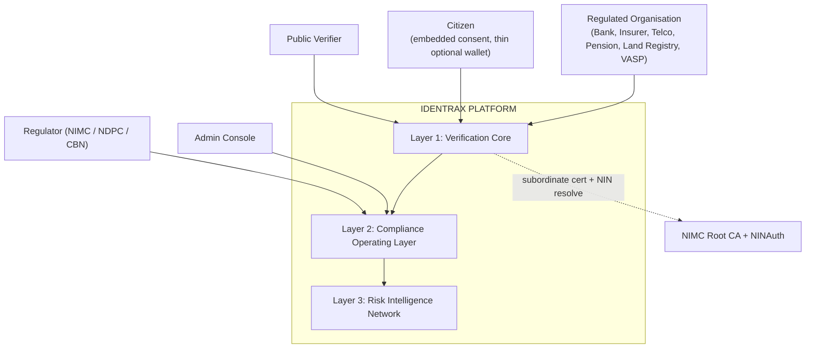
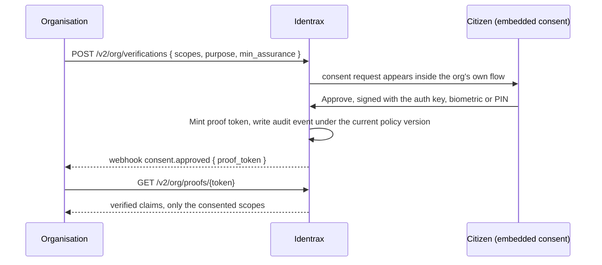
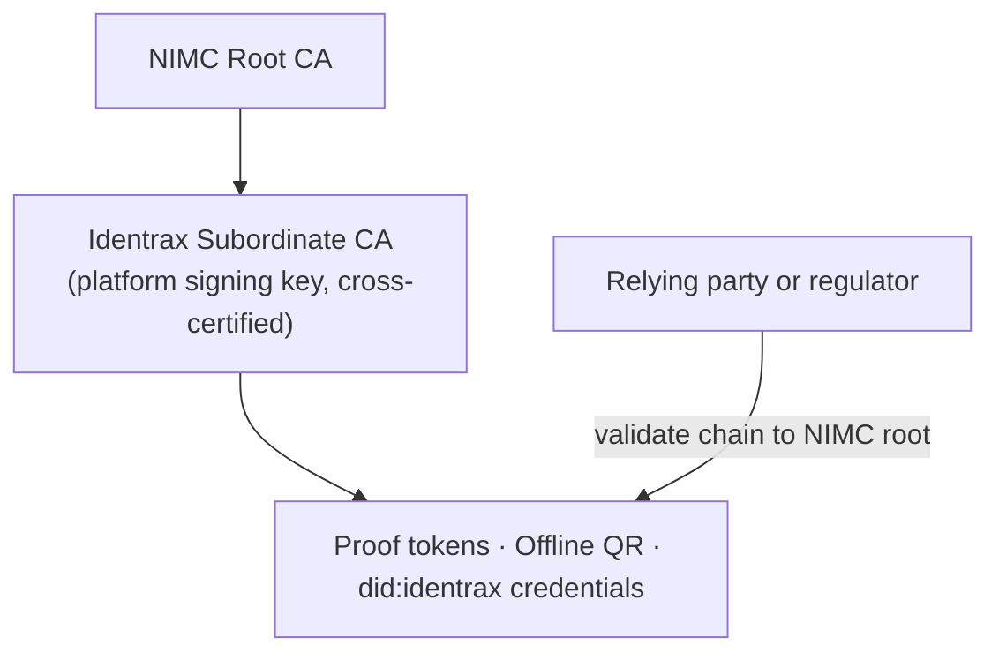
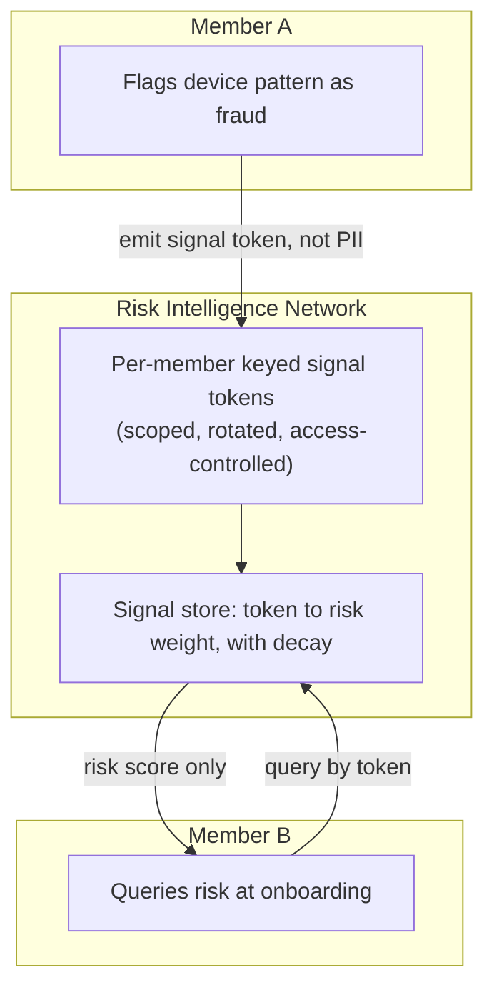

# Identrax: An Organization-First Identity Risk Operating System for Regulated Africa

**Whitepaper v2.0**

*July 2026*

---

## Abstract

Nigeria has over 220 million citizens, yet verifiable digital identity remains fragmented, centralized, and privacy-hostile. Financial institutions, telcos, insurers, employers, and government agencies each build isolated KYC silos, duplicating effort, increasing breach surface, and forcing citizens to surrender raw personal data to every requesting party with no visibility into how that data is used.

The National Identity Management Commission Act 2026, signed into law on 27 June 2026, changed the ground beneath this problem. It makes NIN verification mandatory across banking, telecoms, land, pensions, insurance, and tax, it names NIMC as the Root Certification Authority for Nigeria's national public key infrastructure, and it puts every organization that touches identity data on notice of tougher audits and severe penalties for getting it wrong. Overnight, identity compliance became a funded, board-level priority for every regulated institution in the country.

**Identrax** is our answer. We are building an organization-first identity risk operating system that a bank, insurer, pension administrator, telco, land registry, or crypto platform integrates once and then never has to rebuild around the next NIMC directive, CBN circular, or NDPA amendment. We anchor to the citizen's existing NIN, we return verified claims rather than raw personal data, we capture the citizen's own cryptographically signed consent as legal evidence, and we operate strictly as a data processor rather than a controller so that we never recreate the duplication and breach-amplification problem we exist to solve.

This whitepaper presents the problem space, our architectural philosophy, the three-layer product, the technical design, the security and privacy model, and our regulatory alignment. Where an earlier version of this document described a consumer wallet, this version reflects our repositioning to an organization-first platform and our move to a Rust backend.

---

## Table of Contents

1. [The Problem and the Catalyst](#1-the-problem-and-the-catalyst)
2. [Vision and Principles](#2-vision-and-principles)
3. [Strategic Thesis: Three Layers](#3-strategic-thesis-three-layers)
4. [System Overview and the Five Surfaces](#4-system-overview-and-the-five-surfaces)
5. [Identity Model and Progressive Assurance](#5-identity-model-and-progressive-assurance)
6. [Consent Architecture](#6-consent-architecture)
7. [Cryptographic Foundation and PKI Alignment](#7-cryptographic-foundation-and-pki-alignment)
8. [Verification Protocol](#8-verification-protocol)
9. [Compliance Operating Layer](#9-compliance-operating-layer)
10. [Risk Intelligence Network](#10-risk-intelligence-network)
11. [Decentralized Identity and Zero-Knowledge Proofs](#11-decentralized-identity-and-zero-knowledge-proofs)
12. [Credit Scoring and AML Screening](#12-credit-scoring-and-aml-screening)
13. [Know Your Business and the Travel Rule Module](#13-know-your-business-and-the-travel-rule-module)
14. [Offline Verification](#14-offline-verification)
15. [Data Governance: Processor, Not Controller](#15-data-governance-processor-not-controller)
16. [Security Model](#16-security-model)
17. [Privacy by Design](#17-privacy-by-design)
18. [Platform Architecture: the Rust Backend](#18-platform-architecture-the-rust-backend)
19. [Integration Model and Developer Experience](#19-integration-model-and-developer-experience)
20. [Economic Model](#20-economic-model)
21. [Regulatory Alignment](#21-regulatory-alignment)
22. [Competitive Landscape](#22-competitive-landscape)
23. [Roadmap](#23-roadmap)
24. [Conclusion](#24-conclusion)
25. [References](#25-references)

---

## 1. The Problem and the Catalyst

### 1.1 Identity fragmentation

Nigeria's identity ecosystem is deeply fragmented. Citizens interact with multiple identity systems, NIN, BVN, voter's card, driver's license, and international passport, each maintained by different agencies with limited interoperability. Verifying a citizen requires organizations to independently connect to each source, creating redundant infrastructure and inconsistent experiences.

### 1.2 The KYC duplication problem

Every bank, fintech, telco, insurer, and government service runs its own KYC process. A single citizen may complete KYC dozens of times, each time surrendering the same raw personal data to yet another database. This creates data duplication across hundreds of databases with varying security postures, amplifies every breach, leaves citizens with no visibility into who holds their data, and forces every organization to bear the full cost of verification infrastructure.

### 1.3 The trust deficit

Current verification APIs return raw personal data to the requesting organization. Once data leaves the authoritative source, there is no way to restrict what the organization does with it, limit retention, notify the citizen, or revoke access after the purpose is served. This is a fundamental trust deficit between citizens and institutions.

### 1.4 Financial exclusion

A large share of Nigerian adults remain unbanked or underbanked, and the cost and friction of identity verification is a significant driver. A portable, reusable identity that lets a regulated business say yes to a customer today, while staying defensible, directly expands inclusion.

### 1.5 The catalyst: the NIMC Act 2026

The Act reframed all of the above from a slow structural problem into an urgent, funded one. We read five provisions as directly shaping what we build and how we sell it.

| Act provision | What it means for us |
|---------------|----------------------|
| NIMC named Root Certification Authority for national PKI | Our platform signing key must chain to NIMC rather than stand as an independent trust root. |
| NIN mandatory across banking, telecoms, land, pensions, insurance, tax | Our addressable surface expands well past fintech KYC into several newly obligated verticals. |
| NIMC will intensify audits of third-party integrators | Audit export and compliance posture become core, sellable products rather than logging side-effects. |
| Minimum five-year sentences and fines up to ₦20 million for identity misuse | Every regulated institution now has a funded, board-level reason to buy compliance protection. |
| Special enrolment measures promised for vulnerable groups, regulations pending | Our progressive assurance model is a ready-made technical answer to a question NIMC has committed to solving. |

---

## 2. Vision and Principles

### 2.1 Vision

We want a Nigeria where every regulated institution can verify identity without collecting it, where the citizen's consent is explicit and provable, and where identity compliance is something an organization plugs into once rather than rebuilds with every new directive.

### 2.2 Core principles

| # | Principle | Description |
|---|-----------|-------------|
| 1 | NIN is the sole root | We do not mint identities. Every Identrax identity anchors to a verified NIN. |
| 2 | Keys never leave the device | We store only public keys. Private keys live in the device secure keystore. |
| 3 | No passwords, ever | All authentication is cryptographic challenge and response. No shared secrets. |
| 4 | Consent is explicit, scoped, and revocable | Every access requires a fresh, purpose-bound, time-limited grant the citizen can revoke. |
| 5 | Proofs over PII | We return verified boolean claims, not raw personal data, unless the citizen explicitly consents to more. |
| 6 | Immutable audit trail | Every sensitive operation writes an immutable audit event the citizen can see. |
| 7 | Processor, not controller | We resolve and attest to claims. We do not become the system of record for aggregated PII. |
| 8 | Offline-capable | Core verification works without internet through signed QR codes. |
| 9 | Never sell data | We will never sell, trade, or monetize personal identity data. |

### 2.3 Non-goals

We will never sell raw identity data, run social or political scoring, serve advertising, perform behavioral surveillance, replace NIN or any government identity system, or store biometric templates. We are also explicitly **not** building a consumer wallet that depends on citizens independently discovering and adopting an app before we can earn revenue, and we are not building a data warehouse that aggregates identity documents across sources.

---

## 3. Strategic Thesis: Three Layers

We build in three layers. Each has a distinct job in how we land, retain, and defend a client.

- **Verification Core** is our wedge. It is the fast, low-cost yes that a compliance officer can approve without a committee.
- **Compliance Operating Layer** is our retention product. It delivers audit-ready reporting, a live compliance posture, and a policy engine that absorbs regulatory change so a client's integration never needs a code change when a rule moves.
- **Risk Intelligence Network** is our moat. It shares cross-organization fraud signal that grows more valuable for every member as more organizations join, without any organization ever seeing another's raw data.

### 3.1 Why organization-first over a two-sided platform

A wallet-first model needs citizens to adopt an app on their own, organizations to integrate on their own, and both sides to reach density before consent feels normal. That is three adoption curves to climb before any revenue. By selling to the organization first, we collapse this into one motion. The organization pays us, drives its own customers through onboarding, and our consent and proof layer ships invisibly inside a flow the organization already owns. The citizen-side cryptographic capability is still essential, because signed consent is what makes our compliance guarantee real, but it reaches the citizen embedded in the organization's product rather than as a destination app they must find (see Section 6.4).

---

## 4. System Overview and the Five Surfaces

We organize the platform around who is talking to us. There are five surfaces, each with its own authentication and, in most cases, its own frontend.



| Surface | Who it is | How it authenticates |
|---------|-----------|----------------------|
| Wallet | The citizen, through an embedded SDK or a thin optional app | Ed25519 challenge and response, device-bound keys |
| Organization | A regulated institution | OAuth client credentials, short-lived access token |
| Admin | Our operations team | Rotating admin key, IP allowlist, per-action audit |
| Regulator | NIMC, NDPC, or CBN auditors | Regulator-scoped, read-only credential |
| Public verifier | Anyone verifying a proof, DID, or offline token | No account needed; signature checks do the work |

A wallet token can never call an organization endpoint, an organization token can never reach admin, and a regulator credential is read-only by construction.

---

## 5. Identity Model and Progressive Assurance

### 5.1 NIN anchoring

Every Identrax identity begins with a verified NIN. We create a cryptographic binding between the citizen's device-held keys and their government-issued NIN. We do not build a parallel identity database.

| Field | Storage method | Purpose |
|-------|----------------|---------|
| NIN | SHA-256 hash | Lookup and deduplication |
| NIN (last 4) | Plaintext | Display hint for the citizen |
| NIN (full) | AES-256-GCM encrypted | Recovery and re-verification, optional |
| Name, DOB, and so on | Not stored | Retrieved on demand via NIMC with consent |

### 5.2 Progressive assurance

We treat assurance as a ramp, not a floor. A regulated client can onboard a customer today at a low tier, stay defensible under the Act, and let us upgrade the customer automatically as their verification deepens, rather than forcing a binary comply-or-exclude decision at account opening.

| Level | Requirement | What it means |
|-------|-------------|---------------|
| **L0 (provisional)** | Alternative-signal eligibility (phone, address intelligence, telco or utility signal) before NIN verification completes | A non-authoritative holding state that lets a client say yes with capped limits. NIN remains the sole root; L0 is a consent-layer eligibility state, not an independent identity authority. |
| L1 | NIN verified via NIMC | CBN Tier 1 |
| L2 | L1 plus device-bound hardware-attested keys | Binds identity to a specific device |
| L3 | L2 plus biometric or PIN-verified action | CBN Tier 2, higher limits |
| L4 | L3 plus verified address | Unlocks land, insurance, higher-tier banking |
| L5 | L4 plus verified employment or income | Lending, credit, pensions |
| L6 | L5 plus continuous risk monitoring | Feeds the Risk Intelligence Network |

L0 is our technical answer to the Act's promised vulnerable-groups provision, and it is a story regulators want to hear. It carries explicit safeguards: capped transaction limits, mandatory upgrade prompts, and a hard expiry after which the account cannot transact until it reaches L1. To keep the citizen burden matched to the value at stake, L0 and L1 can be satisfied with a light, server-mediated confirmation, while the full device-key ceremony and biometric-gated signing are required from L2 upward, where transaction value and fraud exposure justify them.

### 5.3 Device-bound keys

Each citizen device holds two Ed25519 keypairs in the secure keystore: an auth key gated by one PIN or biometric for login and consent, and a separate signing key gated by a second PIN for document signing. We hold only the public keys. This follows the Smart-ID two-key separation model, so a compromise of one key does not compromise the other.

---

## 6. Consent Architecture

Consent is the cornerstone. No data flows without an explicit, informed, purpose-bound approval that the citizen signs.

### 6.1 Consent properties

Every grant carries the exact scopes it covers, the purpose it is for, a duration, immediate revocability, and a cryptographic binding: the citizen signs the grant with their auth key, which makes it non-repudiable.

### 6.2 Consent flow



### 6.3 Durable consent and the reuse policy

A live question under the Act is whether a verified claim may be reused, or whether every verification demands a fresh live NINAuth call. We do not hard-code an answer. Every cached or attested claim carries a reuse policy from the policy engine, one of live-only, durable for a window, or durable until revoked. The Verification Core consults this policy before serving a claim, so flipping a purpose or a source from durable to live-only is a configuration change, not a code change. This makes the durable-consent question a switch we can throw per regulator ruling, and it gives us a working model to bring to the table as a technical stakeholder while the regulations are drafted.

### 6.4 The citizen surface: embedded first, thin wallet second

The consent moment is white-labeled inside the client's own onboarding flow. The end customer sees their bank's brand asking clearly to confirm a small, specific set of things about them, nothing more. We deliver this primarily as an embedded SDK and a drop-in web widget, so the citizen never has to find or adopt a separate app. We also keep a thin, optional standalone wallet, but not as a growth engine. It exists mainly to satisfy the data-subject rights the law already requires, letting a citizen see who accessed their data and revoke it, and to offer cross-organization portability for citizens who want one place to manage every consent they have granted.

---

## 7. Cryptographic Foundation and PKI Alignment

### 7.1 Challenge and response

All sensitive operations use a single-use cryptographic challenge. The server issues a challenge with a nonce, an expiry, an audience, and an action type, held in Redis with a short TTL. The client signs it with the device key, the server verifies against the device public key and consumes the challenge atomically. This eliminates password attacks (there are no passwords), replay attacks (challenges are single-use), and session hijacking (signatures are device-bound).

### 7.2 Tokens and encryption

We use PASETO v4.local for session tokens, which removes the algorithm-confusion and `alg: none` classes of attack that afflict JWT. We store only the SHA-256 hash of a token, so a database breach does not expose valid sessions. We hash with SHA-256, and we protect data at rest with AES-256-GCM envelope encryption.

### 7.3 PKI subordination to NIMC's Root CA

This is the most important cryptographic change from our earlier design. Because the Act names NIMC as the Root Certification Authority, our platform signing key can no longer present as an independent trust root. We move our signing key to a subordinate or cross-certified position under NIMC's root, so that proof tokens, offline credentials, and our DID method chain to the national anchor rather than standing parallel to it.



We migrate without breaking existing verifiers. In a dual-anchor phase, proof tokens carry both our signature and, once available, the chain to the NIMC-issued subordinate certificate. On-chain anchoring is retained for tamper-evidence and cross-border resolution, but it is explicitly secondary to the NIMC chain for trust inside Nigeria.

---

## 8. Verification Protocol

### 8.1 Proof tokens

When a citizen approves a request, we issue a short-lived, scope-bound, platform-signed proof token that the organization uses to retrieve verified claims.

```json
{
  "sub": "user:01HXM3NDEKTSV4RRFFQ69G5FAV",
  "aud": "org:example_bank",
  "scopes": ["nin_verified", "name_match", "age_over_18"],
  "claims": { "nin_verified": true, "name_match": true, "age_over_18": true },
  "assurance_level": "L3",
  "issued_at": "2026-07-01T12:00:00Z",
  "expires_at": "2026-07-01T12:10:00Z",
  "proof_signature": "base64url(Ed25519(platform_key, payload))"
}
```

The token is time-limited, scope-bound, platform-signed, optionally single-use, and every access is written to the immutable audit trail.

### 8.2 Document signing

Organizations can request a citizen to sign a document. We store the document hash, the citizen approves with their signing key (the second PIN), and we produce a verification bundle containing the document hash, the signer public key, the signature, a timestamp, a device attestation, and our countersignature, which the organization can verify independently.

---

## 9. Compliance Operating Layer

This is the layer that keeps a client with us. It turns the audit trail from a passive log into three active products.

### 9.1 Regulator-ready audit export

We produce, on demand, a complete evidence pack covering consent records, verification events, and screening decisions for any date range, rendered in NIMC, NDPC, and CBN-consumable formats. Each export is derived from the append-only audit store, Ed25519-signed, and hash-anchored, so it is tamper-evident. This single feature is our renewal insurance: a compliance officer who survives an examination on the strength of our export does not let procurement switch vendors.

### 9.2 Policy engine

The policy engine centralizes every rule that could change when a regulator issues a directive: assurance thresholds per purpose, reuse policies, retention windows, scope-minimization rules, and screening thresholds. When a rule changes, we update the engine once and no client changes a line of integration code. Policies are versioned, and the version in force at each decision is recorded in the audit event, so a past decision is always explainable against the rules that applied then.

### 9.3 Live compliance posture and case review

A per-client dashboard answers the one question a compliance officer truly has: if we were audited tomorrow, what would hurt. Every gap is shown with a severity and a fix path, and a regulatory-change feed pushes a plain-language note when a new directive affects that client and states what we already handled on their behalf. Every flagged or failed verification lands in a human-reviewable case queue with full context, an appeal path, and a decision log, which is at once our fairness mechanism and the client's defense file.

---

## 10. Risk Intelligence Network

Our moat is cross-organization fraud signal shared without raw PII exchange between organizations.

### 10.1 How the signal moves

When an identity or device pattern is flagged as high risk at one member institution, risk scoring rises at another, without either institution seeing the other's underlying data. We achieve this by never moving PII in the first place. Fingerprints are reduced to keyed, non-reversible tokens at the originating organization's boundary, and the network returns only a risk score with decay, never the flagging event, the flagging institution, or the underlying attributes.



### 10.2 The privacy boundary, stated honestly

A salted hash alone does not guarantee privacy, because a low-entropy input such as a device fingerprint can be brute-forced offline. We therefore treat the network's privacy as a threat model, not a slogan. We use per-member and per-purpose keying so that tokens cannot be correlated across organizations, we rotate keys on a schedule, we enforce strict access controls and rate limits on cross-organization queries to blunt membership-inference and enumeration attacks, and we hold the network to a strict isolation invariant: it has no read path into Layer 1 raw inputs or Layer 2 PII, and ingests only signal tokens through a one-way boundary. This boundary is enforced at the module level and verified in a pre-scale security review.

---

## 11. Decentralized Identity and Zero-Knowledge Proofs

### 11.1 Decentralized identifiers

We implement a `did:identrax` method so that a citizen's identity can be resolved and verified beyond Nigerian borders, for visa applications, remote hiring, cross-border banking, and international admissions. Post-Act, the DID chains to the NIMC PKI root rather than presenting as an independent root, and on-chain anchoring provides tamper-evidence and cross-border resolution as a secondary layer.

### 11.2 Zero-knowledge proofs

Even with scoped consent, some checks reveal more than necessary. We support zero-knowledge proofs so that a verifier learns only what they need.

| Claim | What the verifier learns | What they do not learn |
|-------|--------------------------|------------------------|
| `age_over_18` | The person is at least 18 | The exact date of birth |
| `credit_band_good` | The score is in the good band | The exact score |
| `income_above_X` | Income exceeds a threshold | The exact income |
| `resident_of_lagos` | The person lives in Lagos | The exact address |

---

## 12. Credit Scoring and AML Screening

### 12.1 Consented credit scoring

Traditional credit scoring excludes the many adults who lack formal credit histories. Our consent-based model computes a score from multiple signals, utility payments, telco usage, rent, bank transactions, and employment, each of which requires explicit consent. The citizen sees which signals contributed, the score is portable, and where possible we express it as a zero-knowledge band rather than an exact figure.

### 12.2 AML and KYC screening

We provide built-in AML, PEP, sanctions, and adverse-media screening driven by a policy engine, with jurisdiction, enabled sources, fuzzy-match thresholds, risk thresholds, auto-clear rules, and re-screening intervals. A clean result clears automatically where the client policy allows, and a hit routes to the human-reviewable case queue described in Section 9.3, because a false positive that denies someone an account is a direct harm and recreates the exclusion problem we exist to solve.

---

## 13. Know Your Business and the Travel Rule Module

### 13.1 Know Your Business

Every organization that must verify individuals under the Act also has to verify the businesses it works with: corporate customers, vendors, correspondent partners, and beneficial owners. We reuse the exact consent, proof, and audit architecture we built for individuals, applied to company records. Beneficial ownership is always graded with a confidence score, never returned as a bare clean pass, because a clean-looking attestation over a layered shell structure would enable laundering rather than catch it.

### 13.2 The Travel Rule module for crypto and VASPs

Travel Rule obligations require crypto exchanges to identify both sender and receiver on transfers above a threshold without shipping the full identity file between counterparties. Our proof-token architecture maps naturally onto this: we can attest who a counterparty is to another VASP without handing over the customer's full identity file. We run this as an architecturally isolated module with its own compliance monitoring, so movement in the fast-changing crypto rules does not touch the liability profile of our core banking business.

---

## 14. Offline Verification

Connectivity in Nigeria remains uneven, and verification should not fail because of a poor signal. We issue platform-signed QR tokens that can be verified without an internet connection. Online, the citizen requests a token, we produce a signed payload with the user reference, scopes, claims, an assurance level, an issue and expiry time, and a nonce, and the wallet renders it as a QR code held locally. Offline, a verifier scans the code, verifies the signature and expiry, checks the maximum uses, and displays the verified claims, all without contacting us. When connectivity returns, offline usage records are reconciled into the audit trail.

---

## 15. Data Governance: Processor, Not Controller

Under the Act's liability regime this is an invariant, not a preference. We operate as a data processor. We resolve and attest to claims, and we do not become the system of record for aggregated PII. The Verification Core is stateless with respect to source PII, holding NIN only as a hash, a last-four display hint, and an optional encrypted value for re-verification, never a resolved-attributes warehouse. Because we do not aggregate, a breach exposes hashes and minimized claims rather than a national attribute database, which bounds our concentration liability. As the verification layer for many regulated clients at once, a single breach or failed audit would otherwise be a cross-portfolio, criminal-liability event, so the processor-only boundary is our primary structural mitigation, and it is written explicitly into every client contract before signing.

---

## 16. Security Model

We defend in depth across the request path.

| Layer | Controls |
|-------|----------|
| Transport | TLS 1.3, CORS allowlisting, non-root containers |
| Authentication | Ed25519 challenge and response for wallets, OAuth for organizations, rotating keys for admin |
| Authorization | Scope-based access control, ownership checks, consent-gated data access |
| Input validation | ULID format checks, body-size limits, type checking, business-rule validation |
| Rate limiting | Layered global, per-wallet, and per-organization limits, a hard cap on NIN verification per number per day, and lockout after repeated challenge failures |
| Data protection | NIN hashed and encrypted, tokens stored as hashes, webhook secrets encrypted with AES-256-GCM |
| Audit and monitoring | Immutable audit trail, structured JSON logging with no raw PII, health and metrics endpoints, per-source status |
| Idempotency | Idempotency keys with Redis-cached replay protection |
| Blockchain integrity | Content hashes anchored for tamper-evidence, with confirmation waits and gas caps |

Our threat model addresses stolen devices (hardware-backed keys gated by biometric or PIN), database breaches (only hashes stored, NIN encrypted, session tokens hashed), replay (single-use challenges and idempotency), consent forgery (citizen-signed, non-repudiable grants), fake verification (platform-signed, time-limited, anchored proof tokens), and NIN harvesting (strict per-number rate limits, stored only as a hash).

---

## 17. Privacy by Design

We enforce data minimization at every layer: we collect only a hash and last-four of NIN by default, we prefer boolean claims over raw values, proof tokens carry only consented scopes, consent grants carry explicit expiry, and access stops on revocation. Citizens can revoke any consent immediately, revoke device keys to invalidate sessions, view a full audit trail of who accessed their data and why, and request account deactivation. We do not track location beyond optional geo-verified addresses, we do not build behavioral profiles, and we do not share data between organizations without explicit per-organization consent.

---

## 18. Platform Architecture: the Rust Backend

### 18.1 A modular monolith in Rust

We build the backend entirely in Rust as a single deployable binary with strict internal crate boundaries. We moved from our original Go design to Rust for memory safety on a system that handles national identity data, for predictable performance under load, and because the cryptographic and concurrency guarantees matter to us more than raw development speed on this product. The modular monolith gives us the deployment simplicity of a monolith with the code organization of microservices, and the crate boundaries are enforced by the compiler, which is how we keep the Risk Intelligence Network from ever reaching raw verification inputs.

### 18.2 Technology stack

| Concern | What we use |
|---------|-------------|
| Language and runtime | Rust with the Tokio async runtime |
| HTTP framework | Axum, composed over Tower middleware |
| Database | PostgreSQL 16 via SQLx, with compile-checked queries and reviewed migrations |
| Cache and queue | Redis 7 via a connection pool |
| Object storage | S3-compatible, for encrypted document blobs |
| Signatures | Ed25519 via ed25519-dalek |
| Hashing and encryption | SHA-256, and AES-256-GCM for envelope encryption |
| Session tokens | PASETO v4.local |
| Blockchain | An EVM client for anchoring |
| Zero-knowledge | A Groth16 proving and verifying backend |
| Serialization | serde |
| Telemetry | Structured JSON tracing, with health and metrics endpoints |
| Container | Multi-stage Docker, distroless final image, non-root |

### 18.3 Workspace shape

We organize the backend as a Cargo workspace with one binary crate that assembles the router and middleware, and one library crate per domain: identity, auth, challenge, consent, proof, the verification core and its source connectors, screening, credit, biometric, DID, blockchain, zero-knowledge, offline, signing, profile, audit, policy, compliance, the risk network, KYB, the Travel Rule module, webhooks, notifications, organization lifecycle, and admin. A crate can only reach another crate it declares as a dependency, so our trust and data-governance boundaries are compiler-enforced rather than convention.

---

## 19. Integration Model and Developer Experience

### 19.1 How an organization onboards

We create the organization and issue an API key and secret, we approve exactly the scopes their use case needs and no more, they register signed webhook endpoints, they authenticate through OAuth to receive a short-lived token, they run a full verification loop against our sandbox with test NINs, they sign the processor and controller boundary into their contract, and we enable production. A basic integration takes an afternoon, and no sales call is required to start building.

### 19.2 The developer experience we hold ourselves to

Compliance infrastructure succeeds or fails on experience, not on cryptography. We issue sandbox keys instantly on signup, with test data that exercises every response path including failures and timeouts. We ship one clean REST API plus SDKs for the stacks Nigerian teams actually use, a drop-in consent widget for teams that do not want to build UI, copy-paste quickstarts that reach a successful sandbox verification quickly, webhooks as the default pattern with signed payloads and automatic retries and a replay tool, honest error design where every failure returns a specific documented reason code and a suggested next action, and a public status page with per-source health so a client can see when an upstream source is degrading and see our cached degraded-mode take over.

### 19.3 SDKs

We ship server-side SDKs for Rust, JavaScript and TypeScript, Python, Java and Kotlin, PHP, Go, and .NET, each wrapping the full organization API, handling token refresh and idempotency and retries, and verifying webhook signatures. On the client side we ship a Flutter wallet SDK, a web consent widget, a React Native SDK, and native mobile bindings, so the consent and signing experience ships inside the organization's own product. For teams that want the minimum, we ship small single-purpose webhook-verification libraries in each language.

### 19.4 Degraded mode

Because every client depends on NIMC, we define a degraded-mode SLA rather than failing open or hard-closing. In normal mode we resolve live per the reuse policy. In degraded mode, when NIMC is unreachable, we serve claims within a cached validity window for purposes whose policy permits it, queue live-only requests, and surface a clear status to the client. In an extended outage we reject new high-assurance onboarding while allowing capped L0 provisional onboarding with a reconciliation obligation on recovery. When the source returns, all degraded-mode decisions are reconciled against live responses and the audit trail is updated.

---

## 20. Economic Model

### 20.1 Why we do not quote one flat price

A flat price per verification hides our real cost structure and leads to two mistakes at once, overcharging a simple NIN check and undercharging a full compliance bundle. Going directly to NIMC carries a substantial fixed cost in access licensing before a single bulk credit is bought, which is why almost no bank or fintech connects directly and why aggregators exist. Our sourcing is staged: we begin on an aggregator or reseller arrangement to reach the market immediately, and we move to a direct NIMC license once our monthly volume makes that economical, at which point owning direct access becomes a moat in itself because it makes us the layer others resell.

### 20.2 We price by what is actually included

We price by tier, so a client pays for what they use and our compliance and consent layer, not the raw lookup, is what earns our margin. A NIN-only tier returns a single boolean claim. A NIN-plus-BVN tier cross-matches two government-linked sources. A full KYC bundle adds a signed consent proof token, an audit trail entry, and webhook delivery, which cost us a fraction of a cent to produce, so the margin on the bundle comes from the compliance envelope rather than from marking up a government lookup. An enhanced bundle adds AML, PEP, and sanctions screening plus biometric liveness, and carries a higher price because the screening input cost is genuinely higher.

### 20.3 The revenue stack

Beyond per-verification fees, we stack platform subscriptions that become a budget line item, legacy-book re-verification projects for insurers and pension administrators newly obligated under the Act, premium modules such as screening and address verification and credit scoring, a Compliance-as-a-Service retainer for audit readiness and regulatory-change management, paid access to the Risk Intelligence Network, white-label SDK licensing, and a marketplace take-rate on third-party verifiers routed through us. As the mix shifts from per-call revenue toward subscriptions, retainers, and network fees, our blended gross margin rises, which is what makes us a software business rather than a reseller.

---

## 21. Regulatory Alignment

### 21.1 NDPA 2023

We are designed for the Nigeria Data Protection Act. We rely on explicit consent as our lawful basis, we bind consent to a purpose, we minimize data with boolean claims and scoped access, we anchor to NIN for accuracy, we give consent an explicit expiry with immediate revocation, we protect data with encryption and hashing and TLS, and we give the data subject audit visibility, revocation, and deactivation.

### 21.2 CBN KYC tiers

Our assurance ladder maps to CBN's risk-based tiers: L1 and L2 to Tier 1, L2 and L3 to Tier 2, and L3 through L5 to Tier 3, with our L0 provisional state sitting below Tier 1 under capped limits.

### 21.3 The NIMC Act and our accreditation posture

We do not compete with or replace NIMC. We use NIN as our sole identity root, we verify through official NIMC channels, and we complement NIMC with a consent, audit, and risk-intelligence layer. Given NIMC's new role as Root Certification Authority, we are clarifying whether our platform signing key should become a cross-certified or subordinate participant in NIMC's PKI hierarchy rather than remaining an independent trust root, and we treat that as near-term design work. The Act's implementing regulations for private-sector integrators are still to be issued, so we are starting the MOU, ASA license, and NDPC registration conversations ahead of finalization, which positions us as a reference implementation rather than a late entrant in a queue that forms once the rules settle.

### 21.4 International standards

We align our DID method to W3C DID Core, our proof format to W3C Verifiable Credentials, our assurance levels to the eIDAS Low, Substantial, and High tiers, and our security architecture to the ISO 27001 control framework, with certification and NDPC processor registration treated as prerequisites to enterprise general availability rather than aspirations.

---

## 22. Competitive Landscape

Smile Identity, Youverify, VerifyMe, Prembly, and Dojah compete mainly on raw KYC speed and price. None of them leads with regulator-ready audit export, legacy-book re-verification at scale, or a cross-organization risk network. Our differentiation is not faster or cheaper verification. It is that we absorb a client's ongoing NIMC Act compliance and audit exposure, backed by a consent-and-proof architecture that returns claims rather than raw PII, unlike most incumbent KYC APIs. A generic compliance pitch would not be defensible; the combination of the compliance operating layer, progressive assurance, and the risk network is.

---

## 23. Roadmap

We already built much of the original architecture: NIN-anchored registration, device-bound keys, consent management, proof tokens, document signing, the audit trail, credit scoring, AML screening, biometric attestation, blockchain-anchored DIDs, zero-knowledge proofs, and offline QR verification. What remains to reach a sellable, production-ready system is closer to four months than the year a typical enterprise compliance product takes, because we already made the hard architecture decisions.

- **Month 1, harden the core.** We move NIN and BVN from sandbox to production through an aggregator arrangement, bring the consent engine and proof tokens to production load, and ship the developer-experience baseline of instant sandbox keys, quickstarts, SDKs, webhooks with replay, and the status page.
- **Month 2, build the Compliance Operating Layer.** We ship the regulator-ready audit export first because it closes pilots, ship the compliance posture dashboard and the case review queue, and complete verified address and verified income on the assurance ladder.
- **Month 3, pilot the network and new modules.** We run the Risk Intelligence Network with a few pilot organizations on anonymized signal only, build a first pass of Know Your Business and the legacy-book re-verification pipeline, and build a first pass of the isolated Travel Rule module.
- **Month 4, harden and launch.** We run penetration and load testing and begin ISO 27001 preparation, define and ship the degraded-mode SLA, and onboard our first paying pilots with the processor and controller boundary written into each contract.

In parallel, on a timeline NIMC and NDPC control rather than one our engineering speed can compress, we start the accreditation, ASA license, and NDPC registration conversations on day one, pursue the aggregator sourcing agreement and the NIMC bulk-credit quote, and pre-position with newly obligated insurers and pension administrators ahead of their implementation circulars.

---

## 24. Conclusion

The NIMC Act 2026 turned identity compliance from background hygiene into a funded, board-level priority for every regulated Nigerian institution, on a compressed timeline. Our architecture, consent-scoped, non-repudiable, and data-minimizing by design, is already aligned with what the law asks for. What is left is executing the organization-first repositioning, winning the beachhead segments, shipping the developer, compliance-officer, and end-customer experiences well enough that developers recommend us and compliance officers refuse to lose us, and moving early on accreditation and PKI alignment before the regulatory landscape settles around whoever gets there first.

We anchor to NIN, we place verified claims rather than raw data at the center, we make consent provable, and we stay a processor rather than a controller. Identity compliance should be something an organization plugs into once. We are building the system that makes it so.

---

## 25. References

1. National Identity Management Commission (NIMC). "About NIN." https://nimc.gov.ng
2. National Identity Management Commission Act 2026. Federal Republic of Nigeria.
3. Nigeria Data Protection Act 2023. Federal Republic of Nigeria.
4. Central Bank of Nigeria. "Anti-Money Laundering and Combating the Financing of Terrorism Regulations."
5. W3C. "Decentralized Identifiers (DIDs) v1.0." https://www.w3.org/TR/did-core/
6. W3C. "Verifiable Credentials Data Model." https://www.w3.org/TR/vc-data-model/
7. PASETO. "Platform-Agnostic Security Tokens." https://paseto.io
8. Estonian Information System Authority. "Smart-ID Technical Documentation."
9. ISO/IEC 27001:2022. "Information Security Management Systems."
10. eIDAS Regulation (EU) No 910/2014. "Electronic Identification and Trust Services."
11. World Bank. "ID4D Global Dataset." https://id4d.worldbank.org
12. Financial Action Task Force. "Guidance on the Travel Rule for Virtual Assets."

---

*© 2026 Identrax. This whitepaper is provided for informational purposes only. The technical specifications and roadmap described herein are subject to change as the platform evolves and as NIMC's implementing regulations and PKI accreditation terms are finalized. Nothing in this document constitutes financial, legal, or investment advice.*
