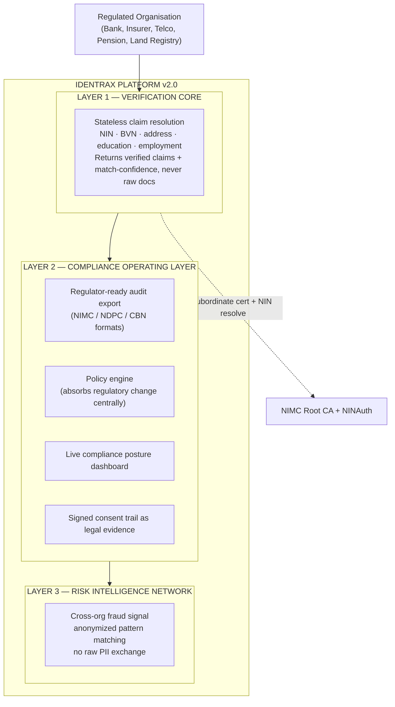
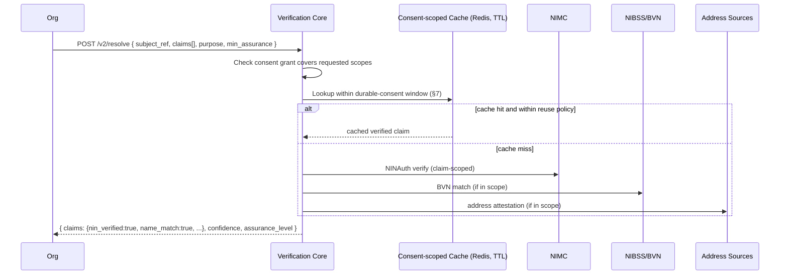
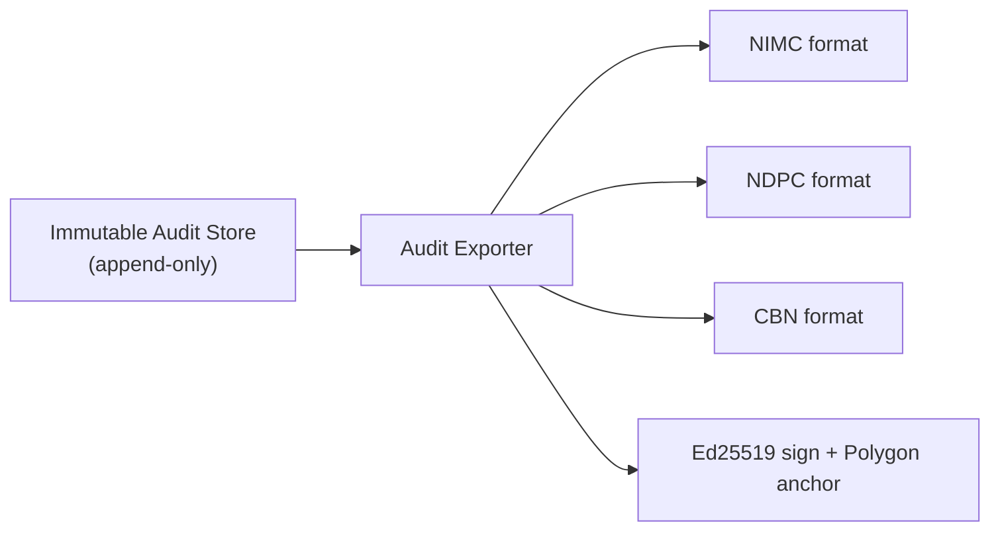
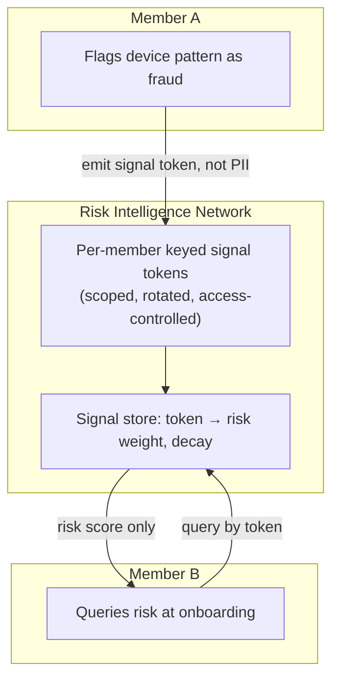
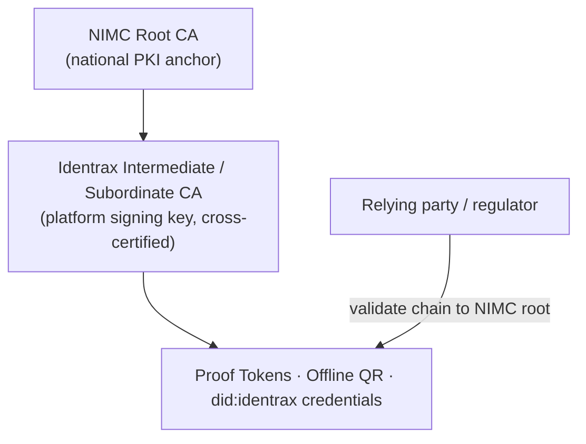
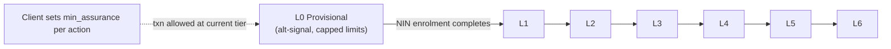
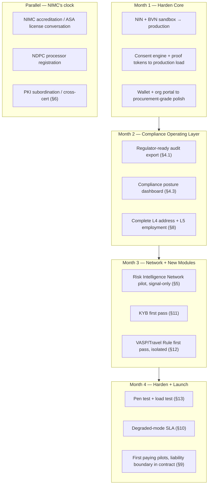

# Identrax Technical Architecture v2.0

## An Organization-First Identity Risk Operating System, Aligned to the NIMC Act 2026

**Technical Design Document v2.0**

*July 2026*

> This document is the technical counterpart to the *Identrax Strategic Positioning, Pricing and Build Plan (v3.0)*. Where v1.0 of the whitepaper (`README.md`) described a consumer-wallet-first identity platform, v2.0 re-frames the same cryptographic core as an **organization-first identity risk operating system** and specifies the architecture required to make that repositioning real under the National Identity Management Commission Act 2026.
>
> The cryptographic foundations of v1.0 — device-bound Ed25519 keys, challenge–response auth, scoped consent grants, proof tokens, the immutable audit trail, ZKP selective disclosure — are unchanged and remain the substrate. This document does not restate them; it specifies what is **new or repositioned**.

---

## Table of Contents

1. [What Changed and Why the Architecture Must Change](#1-what-changed-and-why-the-architecture-must-change)
2. [Architectural Thesis: Three Layers](#2-architectural-thesis-three-layers)
3. [Layer 1 — Verification Core](#3-layer-1--verification-core)
4. [Layer 2 — Compliance Operating Layer](#4-layer-2--compliance-operating-layer)
5. [Layer 3 — Risk Intelligence Network](#5-layer-3--risk-intelligence-network)
6. [PKI Subordination to NIMC's Root CA](#6-pki-subordination-to-nimcs-root-ca)
7. [Durable Consent and the NINAuth Question](#7-durable-consent-and-the-ninauth-question)
8. [Progressive Assurance Model (L0–L6)](#8-progressive-assurance-model-l0l6)
9. [Data Governance: Processor-Only Architecture](#9-data-governance-processor-only-architecture)
10. [Degraded-Mode Operation and NIMC Downtime](#10-degraded-mode-operation-and-nimc-downtime)
11. [Know Your Business (KYB) Module](#11-know-your-business-kyb-module)
12. [VASP / Travel Rule Module](#12-vasp--travel-rule-module)
13. [Security, Certification, and Concentration Liability](#13-security-certification-and-concentration-liability)
14. [Deltas from Whitepaper v1.0](#14-deltas-from-whitepaper-v10)
15. [Build Sequencing](#15-build-sequencing)

---

## 1. What Changed and Why the Architecture Must Change

The NIMC Act 2026 (signed 27 June 2026) changes three things that have direct architectural consequences. The first is a *trust-root* change, the second is a *market-surface* change, and the third is a *liability* change.

| Act provision | Architectural consequence |
|---------------|---------------------------|
| NIMC named **Root Certification Authority** for national PKI | Our platform signing key can no longer present as an independent trust root. It must chain to NIMC. See §6. |
| NIN mandatory across banking, telecoms, land, pensions, insurance, tax | The Verification Core must resolve claims across **more source types than NIN alone**, and the assurance model must serve verticals (land, pensions) that need L4/L5. See §3, §8. |
| NIMC will **intensify audits** of third-party integrators | Audit export and compliance posture become first-class subsystems, not logging side-effects. See §4. |
| 5-year minimum sentence, ₦20M corporate fines for identity misuse | Processor-only data governance and blast-radius containment move from "good practice" to "architectural invariant." See §9. |
| Special enrolment measures for vulnerable groups (regs pending) | A **provisional eligibility tier (L0)** can hold a user in a non-authoritative state until NIN verification completes, so a client can say "yes" defensibly. NIN remains the sole root; L0 is a consent-layer eligibility state, not an independent identity authority. See §8. |

The v1.0 architecture was *designed for* a compliance regime that had not yet arrived. v2.0 is designed for the regime that now exists.

---

## 2. Architectural Thesis: Three Layers

- **Verification Core** is the wedge: the fast, cheap "yes" a compliance officer can approve without a committee.
- **Compliance Operating Layer** is retention: it absorbs regulatory change so the client's integration never needs a code change when a rule moves.
- **Risk Intelligence Network** is the moat: value compounds with every organization added, and no member ever sees another's raw data.

The layers are deployed inside the same modular monolith (Rust with Axum, Tokio, SQLx over PostgreSQL 16, and Redis 7), as detailed in the Engineering Blueprint. The layering is a **trust and data-governance boundary**, not a network boundary: Layer 3 must never be able to read Layer 1's raw resolution inputs.

---

## 3. Layer 1 — Verification Core

### 3.1 Stateless resolution

The Verification Core is a **stateless** identity-resolution service. Given a request for a set of claims about a subject, it fans out to the authoritative sources, normalizes results, and returns **verified claims + match-confidence scores**. It does not persist source documents and does not become a system of record for source PII (see §9).

### 3.2 Claim taxonomy

The Verification Core returns **claims**, not records. Every claim is one of:

- **Boolean** — `identity.nin_verified`, `identity.age_over_18`, `linked_id.bvn.verified`
- **Match** — `identity.name_match` (did the supplied value match the source, yes/no) — never the source value itself
- **Scalar with confidence** — `address.state` + `confidence: 0.0–1.0`
- **Banded** — `credit.band` (via ZKP where the exact score is withheld, whitepaper §9)

This is the technical expression of the strategy's core margin argument: the client pays for the **resolved, minimized claim + the compliance envelope around it**, not for a raw government lookup they could in principle buy themselves.

### 3.3 Multi-source match confidence

Where two or more sources are queried (e.g. NIN + BVN), the Core emits a composite confidence rather than a bare boolean. This directly supports KYB beneficial-ownership scoring (§11), where a "clean" result must be a graded confidence, never a binary pass that could launder a hidden owner.

---

## 4. Layer 2 — Compliance Operating Layer

This is the retention product. It turns the immutable audit trail (whitepaper §13) from a passive log into three active, sellable subsystems.

### 4.1 Regulator-ready audit export

An on-demand exporter that renders the consent-and-verification history of a subject or an organization into the formats a NIMC, NDPC, or CBN auditor consumes. The export is:

- **Derived, never live** — generated from the immutable audit store; producing an export never mutates state.
- **Signed** — each export bundle carries an Ed25519 platform signature and a content hash anchored to Polygon (whitepaper §8.3), so an auditor can prove the export was not altered after issuance.
- **Scoped** — an organization can export only events for which it was the requesting party; NIMC/NDPC exports run under a separate regulator-scoped credential.

### 4.2 Policy engine

The policy engine centralizes every rule that could change when a regulator issues a new directive — assurance thresholds per purpose, retention windows, scope-minimization rules, screening thresholds, re-screening intervals. When a rule changes, we update the policy engine **once**; no client changes a line of integration code.

Policies are versioned and the version in force at the time of every decision is recorded in the audit event, so a past decision can always be explained against the rules that applied *then*, not the rules that apply now.

### 4.3 Live compliance posture

A per-client dashboard that continuously evaluates the client's activity against the current policy set and raises an alert when a regulatory change materially affects that specific client (e.g. a new mandatory scope for a vertical they operate in).

### 4.4 Consent trail as legal evidence

Every consent grant is already Ed25519-signed by the citizen's device and non-repudiable (whitepaper §5.1). Layer 2 packages that trail into a dispute-ready evidentiary bundle: the signed grant, the challenge that authorized it, the policy version in force, and the anchor proof — sufficient to stand as evidence of authorization in an audit or dispute.

---

## 5. Layer 3 — Risk Intelligence Network

The moat. Cross-organization fraud signal **without raw PII exchange between organizations**.

### 5.1 Privacy-preserving signal exchange

When an identity or device pattern is flagged as high-risk at one member institution, risk scoring rises at another **without either institution seeing the other's underlying data**. This is achieved by never exchanging PII in the first place, only keyed, non-reversible signal.

- Fingerprints (device attestation, identity correlation features) are reduced to **keyed tokens** before they enter the network. The pre-image never leaves the originating organization's boundary.
- The network returns a **risk score with decay**, not the flagging event, not the flagging institution, and never the underlying attributes.
- Because the marginal cost of an additional member is near zero and the value to every existing member rises with each join, this is the compounding, hard-to-leave asset the strategy identifies.

### 5.2 The privacy boundary, stated as a threat model

A salted hash alone does not make this private. A device or identity fingerprint is low entropy, so a plain HMAC is open to offline brute-force, cross-organization correlation, and membership inference. We therefore treat the network's privacy as a set of controls, not a slogan:

- **Per-member and per-purpose keying.** Tokens are derived under a key scoped to the emitting member and purpose, so the same subject does not produce a token that correlates across organizations. A member cannot enumerate another member's population.
- **Key rotation.** Keys rotate on a schedule, with a bounded overlap window, so a leaked key has a limited blast radius and historical tokens age out of correlatability.
- **Access control and query limits.** Cross-organization queries are authenticated, rate-limited, and logged, which blunts enumeration and membership-inference attacks that depend on high query volume.
- **No plaintext at rest.** The signal store holds only keyed tokens and risk weights, never the underlying fingerprint.

### 5.3 Isolation invariant

Layer 3 has **no read path** into Layer 1 raw inputs or Layer 2 PII. It ingests only signal tokens emitted through a one-way boundary. This is enforced at the crate boundary (separate schemas, no shared repository access, compiler-checked dependencies) and verified in the pre-scale security review (§13).

---

## 6. PKI Subordination to NIMC's Root CA

This is the single most important new architectural decision, and it reverses a v1.0 assumption.

### 6.1 The problem

Whitepaper §6 and §8 root trust in Identrax's *own* platform Ed25519 signing key and a custom `did:identrax` method anchored to Polygon. Post-Act, NIMC is the **Root Certification Authority** for national PKI. An independent trust root now runs *against* the national hierarchy.

### 6.2 Target: subordinate / cross-certified participant

Identrax's platform signing key becomes a **subordinate certificate** issued under NIMC's root, or is **cross-certified** into NIMC's PKI, depending on what the implementing regulations permit. Proof tokens and offline QR credentials then chain to NIMC's root, so a verifier validates against the national anchor rather than against Identrax alone.

### 6.3 Migration path (non-breaking)

1. **Dual-anchor phase** — proof tokens continue to carry the Identrax Ed25519 signature *and* begin carrying a chain to the NIMC-issued subordinate cert once available. Existing verifiers keep working.
2. **`did:identrax` chaining** — the DID method (whitepaper §8.2) adds a `verificationMethod` whose trust chains to NIMC, so the DID resolves as a national-PKI participant rather than a parallel root.
3. **Polygon repositioned** — on-chain anchoring is retained for tamper-evidence and cross-border resolution, but is explicitly *secondary* to the NIMC chain for in-Nigeria trust. It is no longer presented as the trust root.

The dependency here is regulatory (what subordinate/cross-cert status NIMC actually offers), so this work runs against NIMC's clock and must start as an accreditation conversation on day one — it cannot be compressed by engineering speed.

---

## 7. Durable Consent and the NINAuth Question

The largest open architectural risk. The reusable-verification value proposition — proof-token reuse, the resolution cache (§3.1), offline QR credentials — assumes Identrax may hold and re-attest a verified claim **without** a fresh live NINAuth call on every verification. If the implementing regulations mandate a live call per verification, the reuse economics change.

We design so that **the reuse policy is a configuration, not an assumption**:

- Every cached/attested claim carries a `reuse_policy` derived from the policy engine (§4.2): `live_only`, `durable_ttl(window)`, or `durable_until_revoked`.
- The Verification Core (§3.1) consults this policy before serving a cached claim. Flipping a purpose or a source from `durable` to `live_only` is a policy change, not a code change.
- Offline QR credentials (whitepaper §12) already embed an `expires_at` and `max_uses`; these become the client-side expression of the same reuse policy.

This makes the durable-consent question a **switch we can throw per regulator ruling**, rather than an architectural bet we cannot unwind. It also gives us a concrete, working model to bring to the regulations-drafting table as a technical stakeholder.

---

## 8. Progressive Assurance Model (L0–L6)

Whitepaper §4.2 defines an assurance *ladder* (L1–L6) but treats L1 (NIN verified via NIMC) as a hard floor. The strategy requires a **ramp**, not a floor, so a regulated client can onboard a not-yet-fully-verified user *today* and upgrade them automatically.

### 8.1 The new provisional tier

| Level | Requirement | Purpose |
|-------|-------------|---------|
| **L0 (new)** | Provisional — alternative-signal identity (phone, address intelligence, telco/utility signal) **without** completed NIN verification | Say "yes" defensibly to a user mid-enrolment; maps below CBN Tier 1 with capped limits |
| L1 | NIN verified via NIMC | CBN Tier 1 |
| L2 | L1 + device-bound hardware-attested keys | Device-binding fraud deterrent |
| L3 | L2 + biometric/PIN-verified action | CBN Tier 2, higher limits |
| L4 | L3 + verified address *(build priority)* | Unlocks land, insurance, higher-tier banking |
| L5 | L4 + verified employment/income *(build priority)* | Lending, credit, pensions |
| L6 | L5 + continuous risk monitoring | Feeds Risk Intelligence Network; premium tier |

### 8.2 Automatic upgrade

A client sets a **minimum assurance per action** and a **limit schedule per tier**. As the user completes NIN enrolment and deeper verification, their tier upgrades and their limits rise automatically — no re-onboarding, no binary comply-or-exclude decision at account opening. L0 is precisely the technical answer to the Act's promised (but unwritten) vulnerable-groups provision: we can demonstrate a working, bank-tested tiered model before that regulation is finalized.

L0 carries explicit safeguards: capped transaction limits, mandatory upgrade prompts, and a hard expiry after which the account cannot transact until it reaches L1.

---

## 9. Data Governance: Processor-Only Architecture

Under the Act's liability regime, this is an **invariant**, not a preference.

- Identrax operates as a **data processor**, not a data controller. It resolves and attests to claims; it does not become the system of record for aggregated PII.
- The Verification Core (§3) is stateless with respect to source PII: it holds NIN only as a hash + last-4 + optional AES-256-GCM-encrypted value for re-verification (whitepaper §4.1), never a resolved-attributes warehouse.
- **Blast-radius containment**: because we do not aggregate, a breach exposes hashes and minimized claims, not a national attribute database. This bounds the concentration-liability exposure the strategy flags — one failed audit is not automatically a cross-portfolio PII catastrophe.
- Contracts written with each pilot client encode the **processor/controller liability boundary** explicitly before signing.

Scope creep toward a stored user profile is the specific failure mode this architecture exists to prevent, and it is a standing item in the risk register.

---

## 10. Degraded-Mode Operation and NIMC Downtime

Every client depends on NIMC; if NIMC is down, every client loses onboarding at once. We define a **degraded-mode SLA** rather than failing open or hard-closing.

| Mode | Trigger | Behaviour |
|------|---------|-----------|
| **Normal** | NIMC reachable | Live resolution per reuse policy (§7) |
| **Degraded** | NIMC unreachable | Serve claims within a **cached validity window** for purposes whose policy permits `durable`; queue `live_only` requests; surface a clear status to the client |
| **Hard-closed** | Extended outage past window | Reject new high-assurance onboarding; L0 provisional onboarding may continue under capped limits with a reconciliation obligation on recovery |

On recovery, all degraded-mode decisions are **reconciled** against live NIMC responses and the audit trail is updated — the same reconciliation pattern already used for offline QR verification (whitepaper §12).

---

## 11. Know Your Business (KYB) Module

The natural second product, built by **reusing the individual consent/proof/audit architecture applied to company records**.

- Same claim taxonomy (§3.2), new sources: corporate registry (CAC), beneficial-ownership records, correspondent/vendor attestations.
- **Beneficial ownership is graded, never binary.** A KYB attestation returns a confidence score with an explicit ownership-transparency signal, not a "clean" pass — because a clean-looking attestation over a layered shell structure would *enable* laundering rather than catch it. This is the multi-source-confidence path from §3.3 applied deliberately.
- Roughly doubles capturable spend inside an already-landed client with no second sales motion, because it rides the same integration.

---

## 12. VASP / Travel Rule Module

Isolated by design, per the strategy's edge-case register.

- **Architecturally isolated module** with its own dedicated compliance monitoring, so regulatory movement in the fast-changing crypto space does not touch the liability profile of the core banking business.
- The proof-token architecture maps naturally onto the Travel Rule: we can attest *who a counterparty is* to another VASP **without handing over the customer's full identity file** — verified claims, not raw PII, exactly the primitive the Core already returns (§3.2).
- Runs on the same reuse-policy machinery (§7) but pinned to `live_only`/short-window defaults given the risk profile.

---

## 13. Security, Certification, and Concentration Liability

The strategy correctly notes that "compliance as product" requires the certification stack to **lead** the sales motion, not trail it.

- **Certification, not alignment.** Whitepaper §18.4 lists ISO 27001 / eIDAS / PCI DSS as *alignment*. v2.0 treats ISO 27001 certification, a current penetration-test report, and **NDPC registration as a data processor in our own right** as prerequisites to enterprise GA, tracked as deliverables — not aspirations.
- **Pre-scale security review.** Before outreach scales on the compliance pitch, a dedicated review must confirm consent logging, breach response, access controls, and the **Layer 3 isolation invariant** (§5.2) survive exactly the audits we sell protection from.
- **Concentration liability.** As the verification layer for multiple regulated clients, one breach or failed NIMC audit is a cross-portfolio, criminal-liability event under the Act — so security posture must lead, not run concurrent with, the sales motion. The processor-only architecture (§9) is the primary structural mitigation.

---

## 14. Deltas from Whitepaper v1.0

For readers holding the v1.0 document, this is what v2.0 changes:

| v1.0 (README.md) | v2.0 (this document) |
|------------------|----------------------|
| Consumer-wallet-first, two-sided adoption | Organization-first, single sales motion; wallet ships invisibly inside the client's flow |
| Platform Ed25519 key as independent trust root (§6, §8) | Subordinate / cross-certified under NIMC Root CA (§6) |
| L1 (NIN verified) is the assurance floor (§4.2) | New L0 provisional tier; assurance is a ramp with auto-upgrade (§8) |
| Audit trail as passive log (§13) | Active Compliance Operating Layer: export, policy engine, posture, evidence (§4) |
| Per-verification + subscription revenue (§17) | Tiered pricing where the compliance envelope, not the lookup, is the margin; RIN as compounding moat (§5) |
| "Does not compete with NIMC" (§18.3) — 2007 framing | Names the coming integrator/ASA accreditation regime and PKI subordination as day-one work (§6) |
| ISO/eIDAS/PCI as *alignment* (§18.4) | Certification as a GA prerequisite that leads the sales motion (§13) |
| — | Risk Intelligence Network (§5), KYB (§11), VASP/Travel Rule (§12), degraded-mode SLA (§10) as new subsystems |

The `SmartID-Webhooks/1.0` User-Agent leftover noted in v1.0 §16.2 should be corrected to `Identrax-Webhooks` as part of this work.

---

## 15. Build Sequencing

Aligned to the four-month plan in the strategy document; accreditation and PKI subordination run in parallel on NIMC's clock, not gating the build.

---

*© 2026 Identrax. Internal technical document. The architecture described here is subject to change as NIMC's implementing regulations and PKI accreditation terms are finalized.*
